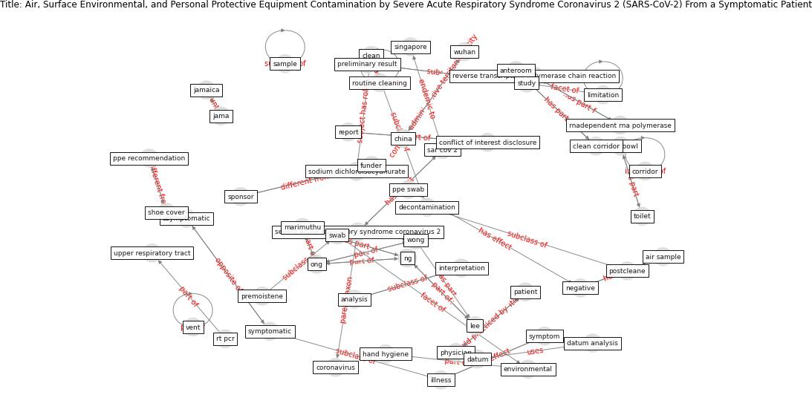

# Article: __Air, Surface Environmental, and Personal Protective Equipment Contamination by Severe Acute Respiratory Syndrome Coronavirus 2 (SARS-CoV-2) From a Symptomatic Patient__ (ong_air_2020)

* [10.1001/jama.2020.3227](https://doi.org/10.1001/jama.2020.3227)
* Cluster: [air-sars](cluster_0)

## Keywords

* marimuthu, ong, wong, ng, [singapore](keyword_singapore), [negative](keyword_negative), [study](keyword_study), [national centre for infectious disease](keyword_national_centre_for_infectious_disease), jama, jamaica, [symptomatic](keyword_symptomatic), illness, [clean](keyword_clean), air sample, [physician](keyword_physician)

## Keywords at large

* [singapore](keyword_singapore), [negative](keyword_negative), [study](keyword_study), [national centre for infectious disease](keyword_national_centre_for_infectious_disease), [symptomatic](keyword_symptomatic), [sample](keyword_sample)

## Concepts

 

### Closest articles 

* [SARS-CoV-2 RNA detection of hospital isolation wards hygiene monitoring during the Coronavirus Disease 2019 outbreak in a Chinese hospital](article_wang_sars-cov-2_2020)
* [Aerosol and Surface Distribution of Severe Acute Respiratory Syndrome Coronavirus 2 in Hospital Wards, Wuhan, China, 2020](article_guo_aerosol_2020)
* [COVID-19 and its Modes of Transmission](article_karia_covid-19_2020)
* [onway-morris_removal_2021](article_onway-morris_removal_2021)
* [Real-world data show that filters clean COVID-causing virus from air](article_thompson_real-world_2021)
* [Current knowledge of COVID-19: Advances, challenges and future perspectives](article_wu_current_2021)
* [COVID-19 Forced Hospitals to Build Negative
Pressure Rooms Fast](article_dyer_covid-19_2020)
* [Rapid expansion of temporary, reliable airborne-infection isolation rooms with negative air machines for critical COVID-19 patients](article_lee_rapid_2020)
* [Sustainability of Coronavirus on Different Surfaces](article_suman_sustainability_2020)
* [Mechanistic insights into the effect of humidity on airborne influenza virus survival, transmission and incidence](article_marr_mechanistic_2019)

