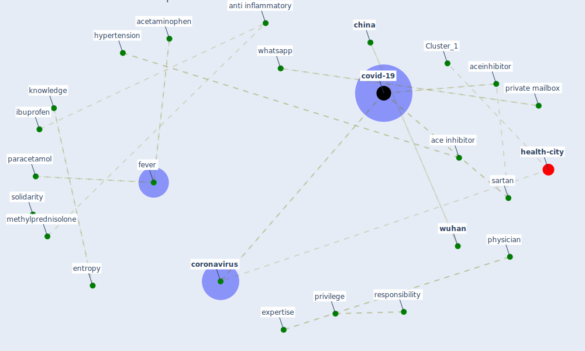

# Article: Infodemic and the spread of fake news in the COVID-19-era (orso_infodemic_2020)

* Source: [10.1097/MEJ.0000000000000713](https://doi.org/10.1097/MEJ.0000000000000713)
* Year: 2020
* Cluster: [air-sars](cluster_9)

## Keywords

 * 2008 summer olympic, SARS-CoV-2, ability, ace inhibitor, aceinhibitor, acetaminophen, acknowledgement conflict of interest, acknowledgement conflict of interest l v, agency, alarm, analgesia, analgesic, angiotensin receptor blocker, anti inflammatory, anti inflammatory drug, [antiviral](keyword_antiviral), attribute, attribute to someone, authenticity, baum ma, [beijing](keyword_beijing), belief, berinsky aj, blindness, cardiology, [cause](keyword_cause), chen x, [china](keyword_china), [conflict of interest](keyword_conflict_of_interest), [coronavirus](keyword_coronavirus), coronavirus covid 19, cortisone, council on hypertension, covid 19 relate acute respiratory distress syndrome, [covid-19](keyword_covid-19), [datum](keyword_datum), degree of uncertainty, democracy, disseminate, dissemination, [drug](keyword_drug), entropy, escardio, european, expert, expertise, [facebook](keyword_facebook), [fake news](keyword_fake_news), [fever](keyword_fever), follower, frighten, hypertension, ibuprofen, inflammation, john milton, [knowledge](keyword_knowledge), lausanne, make information public, manage symptom, medicine agency, menczer f, methylprednisolone, non expert people, [opinion](keyword_opinion), [paracetamol](keyword_paracetamol), paradise lose, [patient](keyword_patient), physician, private mailbox, privilege, reliable, responsibility, sartan, science, scientific community, society of cardiology, solidarity, spirit, strength, study sur le coronavirus covid 19, [symptom](keyword_symptom), technical, term, they be wrong, trust, tweet, [twitter](keyword_twitter), uncertainty, [unesco](keyword_unesco), [united nations](keyword_united_nations), university of pennsylvania, user, vaud, wharton school, whatsapp, word, [world health organization](keyword_world_health_organization), wu c, [wuhan](keyword_wuhan), xia j

## Concepts

 

## Neighbours

### Closest articles

* Coronavirus: Can artificial intelligence be smart enough to detect fake news? - [LINK](article_tong_coronavirus_2020)
* COVID-19 misinformation: Accuracy of articles about coronavirus prevention mostly shared on social media - [LINK](article_obiala_covid-19_2021)
* COVID-19 media fatigue: predictors of decreasing interest and avoidance of COVID-19–related news - [LINK](article_buneviciene_covid-19_2021)
* What drives unverified information sharing and cyberchondria during the COVID-19 pandemic? - [LINK](article_laato_what_2020)
* The changes in the effects of social media use of Cypriots due to COVID-19 pandemic - [LINK](article_kaya_changes_2020)
* Telehealth overpromises during the Covid-19 pandemic - [LINK](article_ostherr_telehealth_2020)
* Emergency Healthcare Facilities: Managing Design in a Post Covid-19 World - [LINK](article_marinelli_emergency_2020)
* The impacts of knowledge, risk perception, emotion and information on citizens’ protective behaviors during the outbreak of COVID-19: a cross-sectional study in China - [LINK](article_ning_impacts_2020)
* Knowledge, attitudes, and practices of Indonesian residents regarding COVID-19: A national cross-sectional survey - [LINK](article_yodang_knowledge_2021)
* Management of the COVID-19 pandemic: challenges, practices, and organizational support - [LINK](article_hossny_management_2022)

### Closest BPs

* Blueprint: Resilience in staffing and skills training - [LINK](bp_12)
* Blueprint: Negative pressure rooms - [LINK](bp_13)
* Blueprint: Air Cleaning Plants - [LINK](bp_15)
