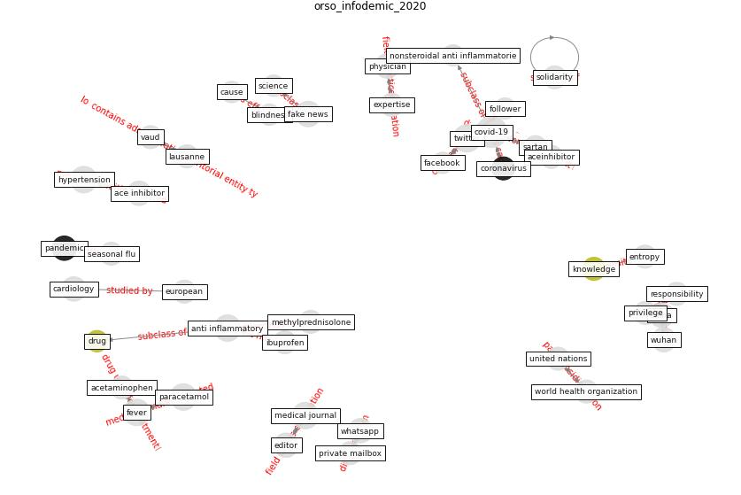

# Article: __Infodemic and the spread of fake news in the COVID-19-era__ (orso_infodemic_2020)

* [10.1097/MEJ.0000000000000713](https://doi.org/10.1097/MEJ.0000000000000713)
* Cluster: [robot-drone](cluster_13)

## Keywords

* [covid-19](keyword_covid-19), [twitter](keyword_twitter), [anti inflammatory](keyword_anti_inflammatory), [medical journal](keyword_medical_journal), [hypertension](keyword_hypertension), [paracetamol](keyword_paracetamol), [opinion](keyword_opinion), [fever](keyword_fever), [ace inhibitor](keyword_ace_inhibitor), [fake news](keyword_fake_news), whatsapp, cardiology, [editor](keyword_editor), word, [china](keyword_china)

## Keywords at large

* [covid-19](keyword_covid-19), [twitter](keyword_twitter), [paracetamol](keyword_paracetamol), [hypertension](keyword_hypertension), [anti inflammatory](keyword_anti_inflammatory), [medical journal](keyword_medical_journal), [fever](keyword_fever), [opinion](keyword_opinion), [ace inhibitor](keyword_ace_inhibitor), [fake news](keyword_fake_news)

## Concepts

 

### Closest articles 

* [Construction of a Linked Data Set of COVID-19 Knowledge Graphs: Development and Applications](article_wang_construction_2022)
* [How loneliness is talked about in social media during COVID-19 pandemic: Text mining of 4,492 Twitter feeds](article_koh_how_2022)
* [Multilevel Analysis of Personal, Non-Medical COVID-19-Related Impact Worldwide](article_dye_multilevel_2020)
* [The Socio-Spatial Determinants of COVID-19 Diffusion: The Impact of Globalisation, Settlement Characteristics and Population](article_sigler_socio-spatial_2020)
* [The socio-economic determinants of COVID-19: A spatial analysis of German county level data](article_ehlert_socio-economic_2021)
* [Climate and the spread of COVID-19](article_chen_climate_2021)
* [Assessing the health and hygiene performance of apartment buildings](article_ho_assessing_2004)
* [Response to COVID-19 in Taiwan](article_wang_response_2020)
* [Treating two pandemics for the price of one: Chronic and infectious disease impacts of the built and natural environment](article_frank_treating_2021)
* [COVID-19 and social inequalities: a complex and dynamic interaction](article_quantin_covid-19_2022)

