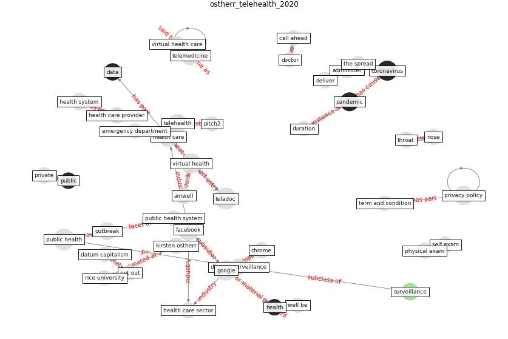

# Article: __Telehealth overpromises during the Covid-19 pandemic__ (ostherr_telehealth_2020)

* URL: [https://www.statnews.com/2020/03/19/telehealth-overpromises-during-the-covid-19-pandemic/](https://www.statnews.com/2020/03/19/telehealth-overpromises-during-the-covid-19-pandemic/)
* Year: 2020
* Abstract: The fear inspired by the \#Covid19 pandemic shouldn't
force people to make data privacy deals with telehealth
companies that work against their long-term well-being.

## Keywords

[coronavirus](keyword_coronavirus), [pandemic](keyword_pandemic), [surveillance](keyword_surveillance)

## Concepts

 

