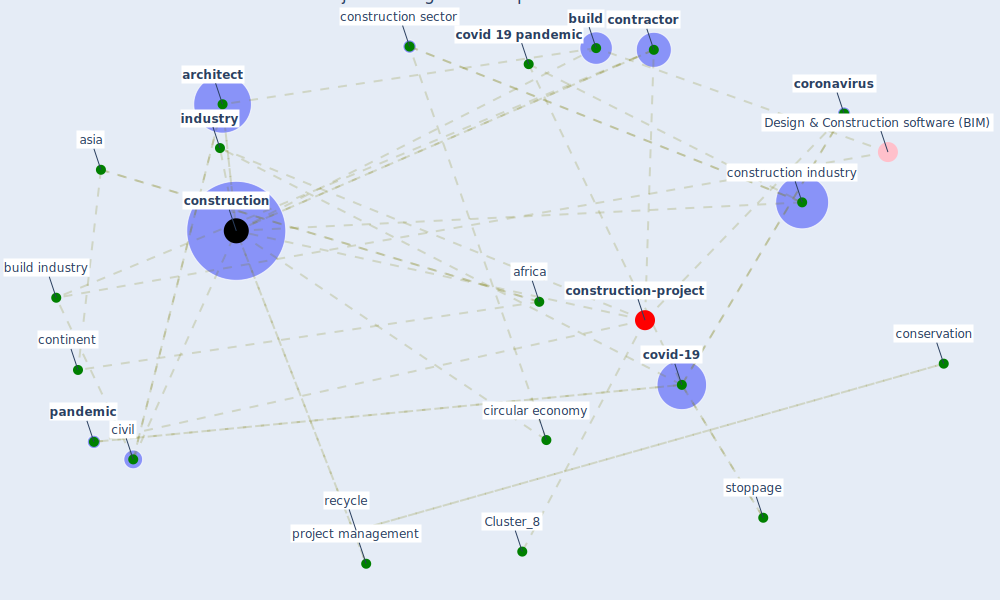

# Article: Effects to Construction Project Management Impacted Circular Economic of Covid-19 Pandemic (paikan_effects_2021)

* Source: [10.30954/2322-0465.1.2021.5](https://doi.org/10.30954/2322-0465.1.2021.5)
* Year: 2021
* Cluster: [construction-project](cluster_8)

## Keywords

 * [africa](keyword_africa), [architect](keyword_architect), asia, bio mimic, blog, [build](keyword_build), build industry, building operation, building site, business decision, [china](keyword_china), chivilo, [circular economy](keyword_circular_economy), civil, civil engineer, commodity, conservation, [construction](keyword_construction), [construction industry](keyword_construction_industry), construction sector, consultant, continent, [contractor](keyword_contractor), [coronavirus](keyword_coronavirus), coronavirus epidemic, [covid 19 pandemic](keyword_covid_19_pandemic), [covid-19](keyword_covid-19), deconstruction, disassembly, dispose of material, disruption, duxbury press, easy random sampling, [effect](keyword_effect), [engineer](keyword_engineer), european commission, european green deal, fill stoppage, financing, fonte, forum, goggle trip, [government](keyword_government), homework, host, hunger, ibnmohamme, idiosyncratic sampling pattern, [india](keyword_india), [industry](keyword_industry), information system, [infrastructure](keyword_infrastructure), linear economy, linkedin, [lockdown](keyword_lockdown), magnitude of the implication, [management](keyword_management), [manhattan](keyword_manhattan), mexico, mexico city, modern world, [nature](keyword_nature), necessary, negative effect, new delhi, new pandemic, [new york city](keyword_new_york_city), other government, [pandemic](keyword_pandemic), part stoppage, perception, personnel decision, [perspective](keyword_perspective), [poland](keyword_poland), post covid 19, primary reason, private preference, product, production, [project management](keyword_project_management), property, publication, [recycle](keyword_recycle), research methodology, reuse, rolandberger, rolandberger retrieve, scarcity, skeleton activity, stoppage, stoppage of work in the building sector, [supply chain](keyword_supply_chain), suspension, suspension of work, termination, true, [unesco](keyword_unesco), work from home, [world heritage site](keyword_world_heritage_site), [wuhan](keyword_wuhan)

## Concepts

 

## Neighbours

### Closest articles

* Overcoming the Impact of COVID-19 Using Integrated Project Delivery Model - [LINK](article_g_overcoming_2020)
* Perception of COVID-19 impacts on the construction industry over time - [LINK](article_rokooei_perception_2022)
* COVID-19 pandemic: the effects and prospects in the construction industry. - [LINK](article_ogunnusi_covid-19_2020)
* Propositions for a Resilient, Post-COVID-19 Future for the AEC Industry - [LINK](article_nassereddine_propositions_2021)
* Mechanisms for addressing the impact of COVID-19 on infrastructure projects - [LINK](article_king_mechanisms_2021)
* Influence between COVID-19 Impacts and Project Stakeholders in Chilean Construction Projects - [LINK](article_araya_influence_2021)
* The Impact of Pandemic Crisis on the Survival of Construction Industry: A Case of COVID-19 - [LINK](article_gamil_impact_2020)
* Revisiting the built environment: 10 potential development changes and paradigm shifts due to COVID-19 - [LINK](article_cheshmehzangi_revisiting_2021)
* The Effects of Pandemic on Construction Industry in the UK - [LINK](article_shibani_effects_2020)
* Guidelines for Responding to COVID-19 Pandemic: Best Practices, Impacts, and Future Research Directions - [LINK](article_assaad_guidelines_2021)

### Closest BPs

* Blueprint: Resilience in staffing and skills training - [LINK](bp_12)
* Blueprint: Installing UV in ductwork - [LINK](bp_10)
* Blueprint: Monitoring of wastewater - [LINK](bp_21)
