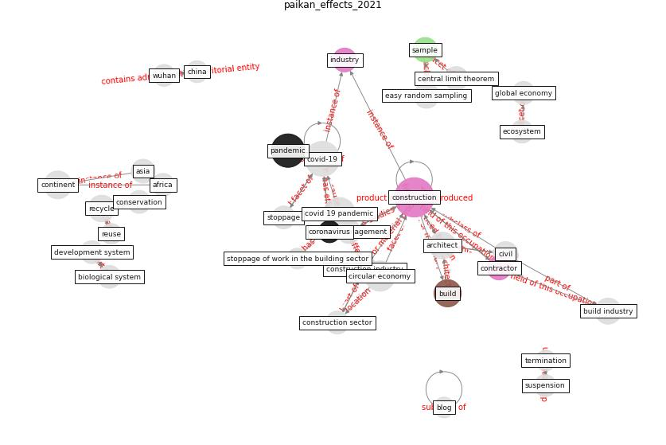

# Article: __Effects to Construction Project Management Impacted Circular Economic of Covid-19 Pandemic__ (paikan_effects_2021)

* [10.30954/2322-0465.1.2021.5](https://doi.org/10.30954/2322-0465.1.2021.5)
* Cluster: [construction-project](cluster_3)

## Keywords

* [construction](keyword_construction), [covid-19](keyword_covid-19), [pandemic](keyword_pandemic), [covid 19 pandemic](keyword_covid_19_pandemic), [circular economy](keyword_circular_economy), [continent](keyword_continent), [build](keyword_build), [recycle](keyword_recycle), [architect](keyword_architect), [deconstruction](keyword_deconstruction), build industry, easy random sampling, [construction industry](keyword_construction_industry), civil, [sample](keyword_sample)

## Keywords at large

* [biophilic design](keyword_biophilic_design), [architecture](keyword_architecture), [sustainable architecture](keyword_sustainable_architecture), [nature](keyword_nature), [design](keyword_design), [biophilic](keyword_biophilic), [environ](keyword_environ), [biophilia](keyword_biophilia), [wellbeing](keyword_wellbeing), [health](keyword_health)

## Concepts

 

