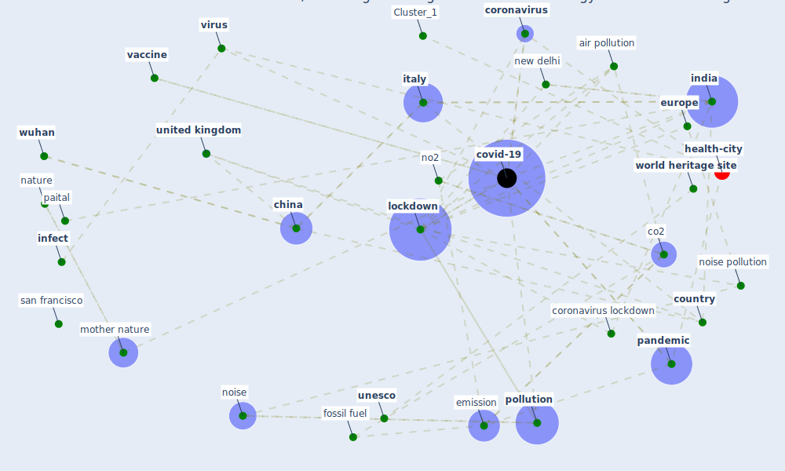

# Article: Nurture to nature via COVID-19, a self-regenerating environmental strategy of environment in global context (paital_nurture_2020)

* Source: [10.1016/j.scitotenv.2020.139088](https://doi.org/10.1016/j.scitotenv.2020.139088)
* Year: 2020
* Cluster: [health-city](cluster_1)

## Keywords

 * 6b, [academy](keyword_academy), acknowledgement, [air pollution](keyword_air_pollution), air quality, [antibiotic](keyword_antibiotic), antimicrob, antivir, bbc, bhubaneswar, [biodiversity](keyword_biodiversity), biotechnol, bird, chile, [china](keyword_china), chloroquine, [climate](keyword_climate), co2, co2 emission, coal, conclusion, constitutional, [coronavirus](keyword_coronavirus), coronavirus disease, coronavirus disease 19, coronavirus lockdown, [country](keyword_country), [covid-19](keyword_covid-19), decibel, delhi, dna, [drug](keyword_drug), ecology, [ecosystem](keyword_ecosystem), ecotoxicol, [education](keyword_education), emilia romagna, emission, [environment](keyword_environment), [europe](keyword_europe), [fossil fuel](keyword_fossil_fuel), homeopathic, hydroxychloroquine, [india](keyword_india), [infect](keyword_infect), [infection](keyword_infection), international, [italy](keyword_italy), kraków, [lockdown](keyword_lockdown), lombardy, macrolide, [malaria](keyword_malaria), mammal, [manufacture](keyword_manufacture), [mask](keyword_mask), mohanty, mother nature, mumbai, nanda, nasa, [nature](keyword_nature), new delhi, nitrogen dioxide, no2, [noise](keyword_noise), noise pollution, odisha, organopathic, orissa, paital, panda, [pandemic](keyword_pandemic), particulate matter, philosophy, [poland](keyword_poland), [pollution](keyword_pollution), prostatic hypertrophy, qatar, remdesivir, road, san francisco, santiago, science, scylla serrata, [social](keyword_social), southern hemisphere, supplementary datum, tab e letter, [temperature](keyword_temperature), tocilizumab, [unesco](keyword_unesco), [united kingdom](keyword_united_kingdom), [united states](keyword_united_states), [usa](keyword_usa), [vaccine](keyword_vaccine), [virus](keyword_virus), [wildlife](keyword_wildlife), [world heritage site](keyword_world_heritage_site), [wuhan](keyword_wuhan)

## Concepts

 

## Neighbours

### Closest articles

* Indirect effects of COVID-19 on the environment - [LINK](article_zambrano-monserrate_indirect_2020)
* Disinfection technology of hospital wastes and wastewater: Suggestions for disinfection strategy during coronavirus Disease 2019 (COVID-19) pandemic in China - [LINK](article_wang_disinfection_2020)
* Air pollution linked with higher COVID-19 death rates - [LINK](article_harvard_th_chan_schoold_of_public_health_air_2020)
* COVID-19 Higher Mortality in Chinese Regions With Chronic Exposure to Lower Air Quality - [LINK](article_pansini_covid-19_2021)
* Seeing the invisible hand: Underlying effects of COVID-19 on tourists’ behavioral patterns - [LINK](article_li_seeing_2020)
* Should I Stay or Should I Go? Tourists’ COVID-19 Risk Perception and Vacation Behavior Shift - [LINK](article_bratic_should_2021)
* The psychological impact of COVID-19 on the mental health in the general population - [LINK](article_serafini_psychological_2020)
* Psychological Effects of Home Confinement and Social Distancing Derived from COVID-19 in the General Population—A Systematic Review - [LINK](article_rodriguez-fernandez_psychological_2021)
* COVID-19 could be a seasonal illness with higher risk in winter: Reduced humidity linked to increased COVID-19 risk - [LINK](article_university_of_sydney_covid-19_2020)
* The changes in the effects of social media use of Cypriots due to COVID-19 pandemic - [LINK](article_kaya_changes_2020)

### Closest BPs

* Blueprint: Resilience in staffing and skills training - [LINK](bp_12)
* Blueprint: Installing UV in ductwork - [LINK](bp_10)
* Blueprint: Negative pressure rooms - [LINK](bp_13)
