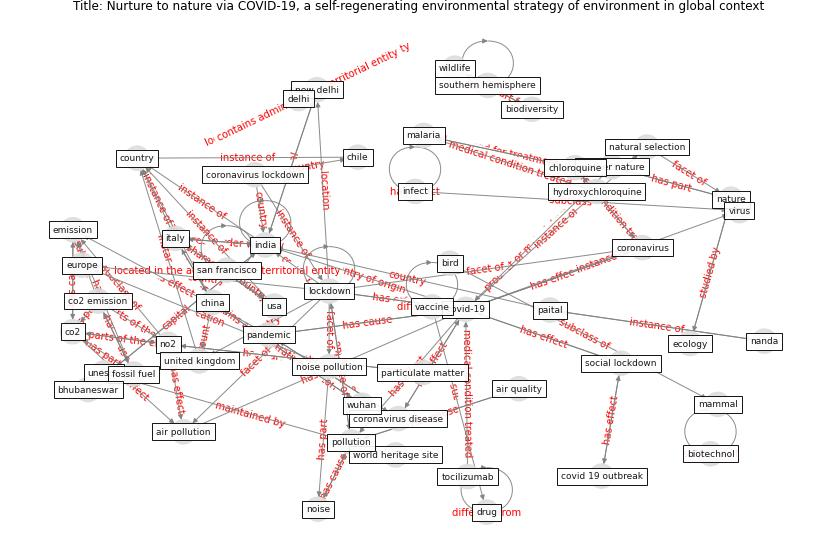

# Article: __Nurture to nature via COVID-19, a self-regenerating environmental strategy of environment in global context__ (paital_nurture_2020)

* [10.1016/j.scitotenv.2020.139088](https://doi.org/10.1016/j.scitotenv.2020.139088)
* Cluster: [air-sars](cluster_2)

## Keywords

* [covid-19](keyword_covid-19), [lockdown](keyword_lockdown), [india](keyword_india), [china](keyword_china), [italy](keyword_italy), [cov 19](keyword_cov_19), [coronavirus](keyword_coronavirus), [pollution](keyword_pollution), [new delhi](keyword_new_delhi), [wuhan](keyword_wuhan), [nature](keyword_nature), [pandemic](keyword_pandemic), noise pollution, mother nature, [country](keyword_country)

## Keywords at large

* [biophilic design](keyword_biophilic_design), [architecture](keyword_architecture), [sustainable architecture](keyword_sustainable_architecture), [nature](keyword_nature), [design](keyword_design), [biophilic](keyword_biophilic), [environ](keyword_environ), [biophilia](keyword_biophilia), [wellbeing](keyword_wellbeing), [health](keyword_health)

## Concepts

 

