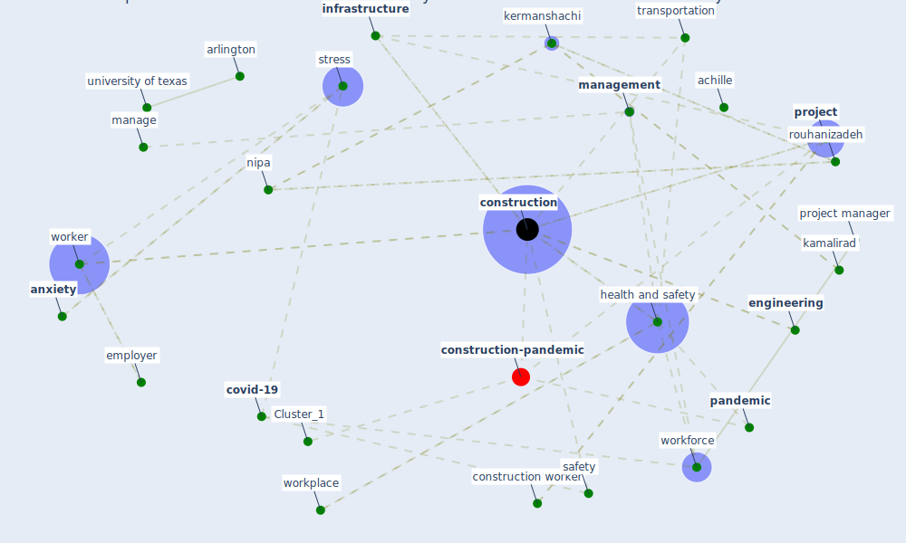

# Article: Impacts of COVID-19 on Health and Safety of Workforce in Construction Industry (pamidimukkala_impacts_2021)

* Source: [10.1061/9780784483541.039](https://doi.org/10.1061/9780784483541.039)
* Year: 2021
* Cluster: [construction-pandemic](cluster_1)

## Keywords

 * achille, [anxiety](keyword_anxiety), araya, [arlington](keyword_arlington), bailey j, [china](keyword_china), chivilo, civil engineering, communication, compute in civil engineering, conference, congress, [construction](keyword_construction), construction conference, [construction industry](keyword_construction_industry), construction management, construction research congress, [construction worker](keyword_construction_worker), [contractor](keyword_contractor), [coronavirus](keyword_coronavirus), [covid 19 pandemic](keyword_covid_19_pandemic), [covid-19](keyword_covid-19), creative construction, creative construction conference, database, direct, disaster preparedness, [drug](keyword_drug), effective communication, [employee](keyword_employee), [employer](keyword_employer), [engineering](keyword_engineering), enr, exposition, family, [fear](keyword_fear), felipe, four step research methodology, [health and safety](keyword_health_and_safety), [infrastructure](keyword_infrastructure), infrastructure project, isolation, james p, jessica, job site safety, kamalirad, karimi, [kermanshachi](keyword_kermanshachi), khalid, kontoangelo, labor productivity, lequarre, lindhout, love p e edwards d sing m j and liu j 2016, m c love p e edwards d sing m j and liu j 2016, madalena, [maintenance](keyword_maintenance), manage, [management](keyword_management), management strategy, mccourt, namian, nichola, nigam, nipa, ontario, [pandemic](keyword_pandemic), papageorgiou, personal, preliminary search, [productivity](keyword_productivity), [project](keyword_project), project manager, publication, relate industry, renier, research congress, research methodology, rouhanizadeh, sadatsafavi, sadness, safapour, [safety](keyword_safety), safety condition, search, secondary search, srinivasan, [stress](keyword_stress), thakur, transportation, transportation infrastructure, university of texas, valentin, wage, [well be](keyword_well_be), work environment, [worker](keyword_worker), workforce, [workplace](keyword_workplace), [wuhan](keyword_wuhan)

## Concepts

 

## Neighbours

### Closest articles

* Analysis of COVID-19 Concerns Raised by the Construction Workforce and Development of Mitigation Practices - [LINK](article_bou_hatoum_analysis_2021)
* Strategies to Mitigate COVID-19 Pandemic Impacts on Health and Safety of Workers in Construction Projects - [LINK](article_kaushal_strategies_2021)
* Identifying Actions to Control and Mitigate the Effects of the COVID-19 Pandemic on Construction Organizations: Preliminary Findings - [LINK](article_raoufi_identifying_2021)
* Guidelines for Responding to COVID-19 Pandemic: Best Practices, Impacts, and Future Research Directions - [LINK](article_assaad_guidelines_2021)
* Influence between COVID-19 Impacts and Project Stakeholders in Chilean Construction Projects - [LINK](article_araya_influence_2021)
* Covid-19 Associated Risks and Mitigation Strategies relevant for the UK Construction Industry - [LINK](article_dan-jumbo_covid-19_2021)
* The Impact of Pandemic Crisis on the Survival of Construction Industry: A Case of COVID-19 - [LINK](article_gamil_impact_2020)
* COVID-19 pandemic: the effects and prospects in the construction industry. - [LINK](article_ogunnusi_covid-19_2020)
* Propositions for a Resilient, Post-COVID-19 Future for the AEC Industry - [LINK](article_nassereddine_propositions_2021)
* Mechanisms for addressing the impact of COVID-19 on infrastructure projects - [LINK](article_king_mechanisms_2021)

### Closest BPs

* Blueprint: Monitoring of wastewater - [LINK](bp_21)
* Blueprint: Smart Locker System - [LINK](bp_1)
* Blueprint: Mental health – Belong: Do something with someone - [LINK](bp_19)
