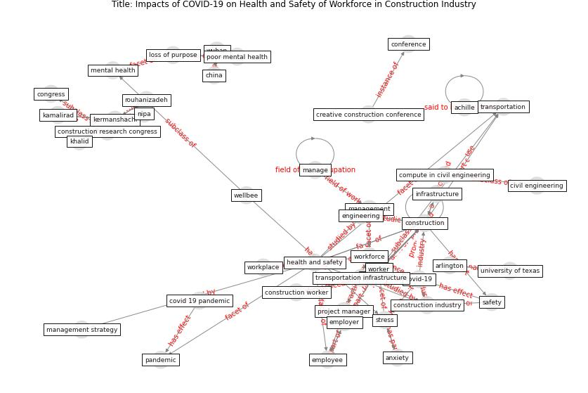

# Article: __Impacts of COVID-19 on Health and Safety of Workforce in Construction Industry__ (pamidimukkala_impacts_2021)

* [10.1061/9780784483541.039](https://doi.org/10.1061/9780784483541.039)
* Cluster: [construction-project](cluster_6)

## Keywords

* [construction](keyword_construction), kermanshachi, [anxiety](keyword_anxiety), [arlington](keyword_arlington), [health and safety](keyword_health_and_safety), [university of texas](keyword_university_of_texas), [transportation](keyword_transportation), [covid-19](keyword_covid-19), [kamalirad](keyword_kamalirad), [project](keyword_project), [stress](keyword_stress), [mental health](keyword_mental_health), rouhanizadeh, nipa, congress

## Keywords at large

* [construction](keyword_construction), [anxiety](keyword_anxiety), [arlington](keyword_arlington), [health and safety](keyword_health_and_safety), [university of texas](keyword_university_of_texas), [transportation](keyword_transportation), [covid-19](keyword_covid-19), [kamalirad](keyword_kamalirad), [project](keyword_project)

## Concepts

 

### Closest articles 

* [It’s time to reimagine where and how work will get done
(PwC’s US Remote Work Survey)](article_pricewaterhousecoopers_its_2021)
* [How is COVID-19 Experience Transforming Sustainability Requirements of Residential Buildings? A Review](article_tokazhanov_how_2020)
* [A study on office workplace modification during the COVID-19 pandemic in The Netherlands](article_hou_study_2021)
* [Mitigation strategies and compliance in the COVID-19 fight; how much compliance is enough?](article_mukerjee_mitigation_2021)
* [The COVID-19 Impact on Flexible Office Space](article_clifton_covid-19_2020)
* [COVID-19 Experience Transforming the Protective Environment of Office Buildings and Spaces](article_phapant_covid-19_2021)
* [The Intelligent Lockdown: Compliance with COVID-19 Mitigation Measures in the Netherlands](article_kuiper_intelligent_2020)
* [Compliance with COVID-19 Mitigation Measures in the United States](article_van_rooij_compliance_2020)
* [COVID-19 and Green Housing: A Review of Relevant Literature](article_kaklauskas_covid-19_2021)
* 

