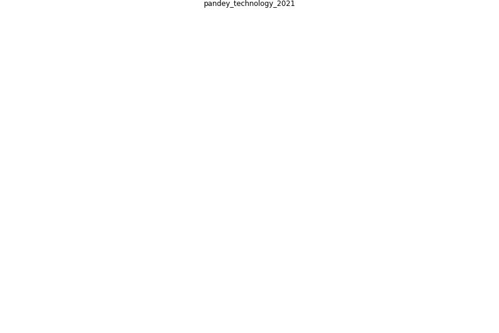

# Article: __Technology intervention for preventing COVID-19 outbreak__ (pandey_technology_2021)

* [10.1108/ITP-05-2020-0298](https://doi.org/10.1108/ITP-05-2020-0298)

## Keywords

## Abstract

Purpose The purpose for writing this article is derived
from the misery and chaos prevalent in the world due to the
coronavirus pandemic – since late 2019 and still
continuing as of December 2020.

Design/methodology/approach A blockchain-based solution to
verify the country visit trail and disease and treatment
history of the passengers who arrive at the immigration
counters located at various national borders and entry
points is proposed. A fuzzy inference based suspect
identifier system is also presented in this article that
could be utilized to make further decisions based on the
degree of suspicion observed on a particular passenger.

Findings This paper attempted to put forth a
blockchain-based system which consumes the healthcare and
visit trail summary of a passenger (appearing for an
interview before an immigration officer) and forwards it to
a fuzzy inference system to reach to a conclusion that the
passenger should be advised to self-quarantine, detained,
or should be allowed to enter. Such a system would help to
make correct decisions at the immigration counters to check
pandemic diseases, like COVID-19, right at the entry
points.

Research limitations/implications

The implications of this work are manifold. First, the
proposed framework works independent of the type of
pandemic and is a readymade tool to check the spread of
disease through infected human carriers. Second, the
proposed framework will keep the mortality rates under
check, which would give ample time for the authorities to
save the lives of the people with co-morbidities and age
vulnerabilities (Vichitvanichphong et al ., 2018). Third,
it is a general phenomenon to restrict the flights from the
country where the first few cases of infection are
discovered; however, the infected person, at the same time,
might travel through alternative routes. The
blockchain-enabled proposed framework ensures the detection
of such cases at no other cost. Finally, the solution may
appear costly in the first place, but it has the potential
to hold back the revenue of the countries that would
otherwise be spent on reactive measures.

Originality/value As of now no other study or research
article provides the solution to the biggest problem
persists in the world in this way. The contribution is
original and worth applying.

## Concepts

 

