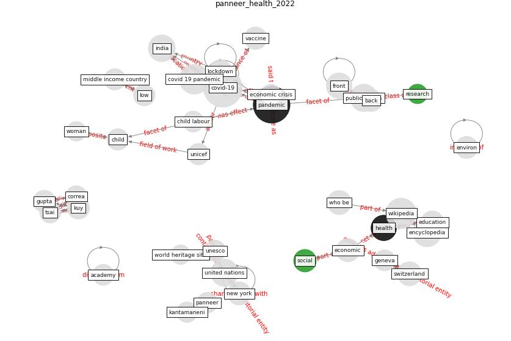

# Article: Health, Economic and Social Development Challenges of the COVID-19 Pandemic: Strategies for Multiple and Interconnected Issues (panneer_health_2022)

* Source: [10.3390/healthcare10050770](https://doi.org/10.3390/healthcare10050770)
* Year: 2022
* Cluster: [economic-health](cluster_9)

## Keywords

 * [academy](keyword_academy), asia, back, capurro, caredeliv, cern, [child](keyword_child), child labour, [china](keyword_china), [coronavirus](keyword_coronavirus), coronavirus pandemic, correa, covid 19 lockdown, [covid 19 pandemic](keyword_covid_19_pandemic), [covid-19](keyword_covid-19), [dataset](keyword_dataset), [datum](keyword_datum), deagosto, dev, develop, disability, disaster, [disease](keyword_disease), documentary film, domestic violence, doyle a, [economic](keyword_economic), [economic crisis](keyword_economic_crisis), [economy](keyword_economy), [education](keyword_education), emergency, emergency preparedness, ferro, front, geneva, [germany](keyword_germany), glob, glob bmj, gupta, happiness, [health](keyword_health), [health care](keyword_health_care), [health system](keyword_health_system), heinrich, hoque, houston, [hubei](keyword_hubei), inclusion and exclusion criterion, [india](keyword_india), innov, kantamaneni, kobayashi, kuy, kwok, lai, learn, literature, [lockdown](keyword_lockdown), [low](keyword_low), middle income country, [misinformation](keyword_misinformation), naher, nation, [new york](keyword_new_york), non communicable disease, nutrition, old person, [pandemic](keyword_pandemic), panneer, pap, poverty, [public health](keyword_public_health), public health crisis, public health emergency, public policy, [research](keyword_research), scientific search engine, scopus, shah, [social](keyword_social), software, strategy, [switzerland](keyword_switzerland), systematic review, teach, tsai, uncertainty, [unesco](keyword_unesco), unicef, [united kingdom](keyword_united_kingdom), [united nations](keyword_united_nations), [usa](keyword_usa), [vaccine](keyword_vaccine), web of science, [well be](keyword_well_be), whelan c, who be, [woman](keyword_woman), [world health organization](keyword_world_health_organization), [world heritage site](keyword_world_heritage_site)

## Concepts

 

## Neighbours

### Closest articles

* COVID-19 and the UN Sustainable Development Goals: Threat to Solidarity or an Opportunity? - [LINK](article_leal_filho_covid-19_2020)
* The COVID-19 pandemic: Lessons on building more equal and sustainable societies - [LINK](article_van_barneveld_covid-19_2020)
* How COVID-19 Redefines the Concept of Sustainability - [LINK](article_hakovirta_how_2020)
* COVID-19: IMPACT OF THE PANDEMIC ON THE SUSTAINABLE DEVELOPMENT GOALS - [LINK](article_samout_covid-19_2020)
* The socio-economic implications of the coronavirus pandemic (COVID-19): A review - [LINK](article_nicola_socio-economic_2020)
* Building up an ecologically sustainable and socially desirable post-COVID-19 future - [LINK](article_duflot_building_2021)
* A critical analysis of the impacts of COVID-19 on the global economy and ecosystems and opportunities for circular economy strategies - [LINK](article_ibn-mohammed_critical_2021)
* Exploring the Potential of Artificial Intelligence and Machine Learning to Combat COVID-19 and Existing Opportunities for LMIC: A Scoping Review - [LINK](article_naseem_exploring_2020)
* Pandemic Analytics: How Countries are Leveraging Big Data Analytics and Artificial Intelligence to Fight COVID-19? - [LINK](article_mehta_pandemic_2021)
* Global value chains: Efficiency and risks in the context of COVID-19 - [LINK](article_oecd_global_2021)

### Closest BPs

* Blueprint: Resilience in staffing and skills training - [LINK](bp_12)
* Blueprint: Smart Locker System - [LINK](bp_1)
* Blueprint: Rotational Shift System - [LINK](bp_0)
