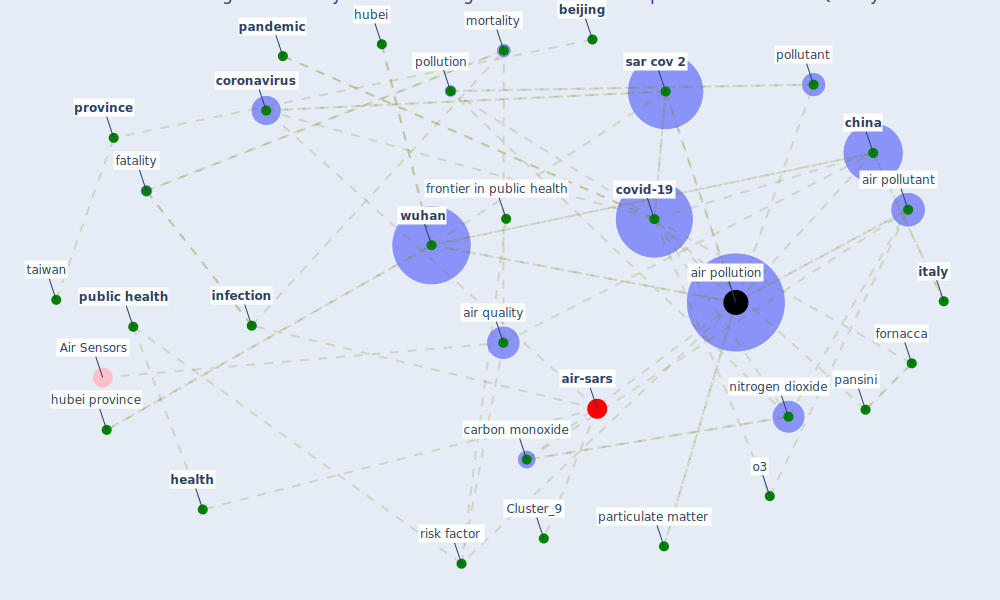

# Article: COVID-19 Higher Mortality in Chinese Regions With Chronic Exposure to Lower Air Quality (pansini_covid-19_2021)

* Source: [10.3389/fpubh.2020.597753](https://doi.org/10.3389/fpubh.2020.597753)
* Year: 2021
* Cluster: [health-city](cluster_1)

## Keywords

 * 114732 pluchino a, administrative unit, adv, [aerosol](keyword_aerosol), [air pollutant](keyword_air_pollutant), [air pollution](keyword_air_pollution), air qual, air quality, air quality index, android, atmos, avian influenza, [beijing](keyword_beijing), bergamo, carbon monoxide, [china](keyword_china), [chinese](keyword_chinese), chronic exposure, chua rl, [city](keyword_city), [coronavirus](keyword_coronavirus), covid 19 outbreak, [covid-19](keyword_covid-19), [dataset](keyword_dataset), distribution, dust, earth engine, ecology, [epidemic](keyword_epidemic), european, european space agency, fang j, [fatality](keyword_fatality), [formaldehyde](keyword_formaldehyde), fornacca, foster wm, front, frontier in public health, frontiersin org, gao gf, google chrome, gr aqi, ground station, hayden fg, haze, hazy, [health](keyword_health), henan, [hubei](keyword_hubei), hubei province, [infection](keyword_infection), [influenza](keyword_influenza), iran, italian, [italy](keyword_italy), kendall rank correlation coefficient, lanzhou, [lockdown](keyword_lockdown), low air quality, lukassen s, manuscript, morbidity, [mortality](keyword_mortality), most densely populate, multi city study, multi dimensional, [nature](keyword_nature), negatively correlate, nitrogen dioxide, non parametric, o3, [pandemic](keyword_pandemic), pansini, particulate matter, [pathogen](keyword_pathogen), [pollutant](keyword_pollutant), [pollution](keyword_pollution), [population](keyword_population), population density, prefecture, [province](keyword_province), [public health](keyword_public_health), [reproduction](keyword_reproduction), risk factor, rτ, [sar cov 2](keyword_sar_cov_2), sentinel 5, [shanghai](keyword_shanghai), smoking, state equivalent, sulfur dioxide, supplementary material, [taiwan](keyword_taiwan), [united states](keyword_united_states), wang b, wei k, [wuhan](keyword_wuhan), xi an, zhao j, zou z

## Concepts

 

## Neighbours

### Closest articles

* Air pollution linked with higher COVID-19 death rates - [LINK](article_harvard_th_chan_schoold_of_public_health_air_2020)
* Nurture to nature via COVID-19, a self-regenerating environmental strategy of environment in global context - [LINK](article_paital_nurture_2020)
* Indirect effects of COVID-19 on the environment - [LINK](article_zambrano-monserrate_indirect_2020)
* Disinfection technology of hospital wastes and wastewater: Suggestions for disinfection strategy during coronavirus Disease 2019 (COVID-19) pandemic in China - [LINK](article_wang_disinfection_2020)
* The changes in the effects of social media use of Cypriots due to COVID-19 pandemic - [LINK](article_kaya_changes_2020)
* What drives unverified information sharing and cyberchondria during the COVID-19 pandemic? - [LINK](article_laato_what_2020)
* Climate and the spread of COVID-19 - [LINK](article_chen_climate_2021)
* Study of COVID-19 pandemic in London (UK) from urban context - [LINK](article_ghosh_study_2020)
* COVID-19 could be a seasonal illness with higher risk in winter: Reduced humidity linked to increased COVID-19 risk - [LINK](article_university_of_sydney_covid-19_2020)
* Effects of temperature and humidity on the spread of COVID-19: A systematic review - [LINK](article_mecenas_effects_2020)

### Closest BPs

* Blueprint: Resilience in staffing and skills training - [LINK](bp_12)
* Blueprint: Installing UV in ductwork - [LINK](bp_10)
* Blueprint: Negative pressure rooms - [LINK](bp_13)
