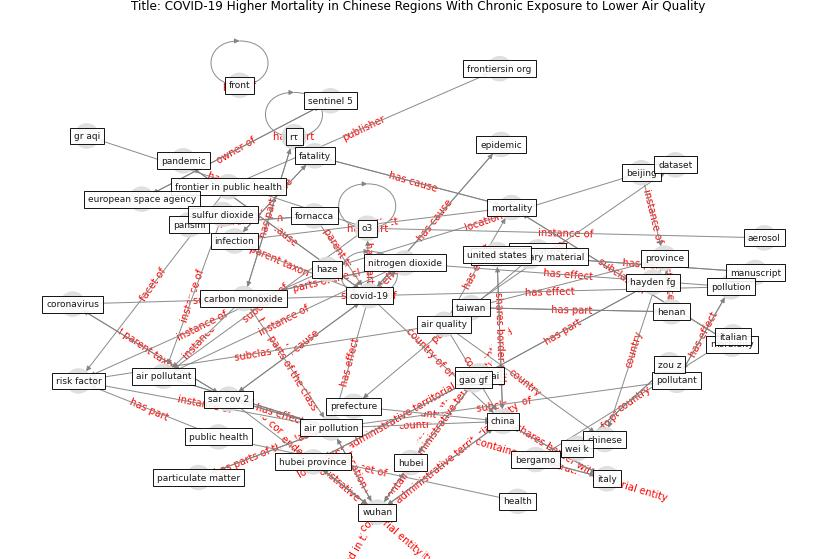

# Article: __COVID-19 Higher Mortality in Chinese Regions With Chronic Exposure to Lower Air Quality__ (pansini_covid-19_2021)

* [10.3389/fpubh.2020.597753](https://doi.org/10.3389/fpubh.2020.597753)
* Cluster: [air-sars](cluster_0)

## Keywords

* [air pollution](keyword_air_pollution), [covid-19](keyword_covid-19), [wuhan](keyword_wuhan), [china](keyword_china), [air pollutant](keyword_air_pollutant), [hubei](keyword_hubei), [mortality](keyword_mortality), [fatality](keyword_fatality), [province](keyword_province), [pollutant](keyword_pollutant), [italy](keyword_italy), [pollution](keyword_pollution), [o3](keyword_o3), [public health](keyword_public_health), [infection](keyword_infection)

## Keywords at large

* [air pollution](keyword_air_pollution), [covid-19](keyword_covid-19), [wuhan](keyword_wuhan), [china](keyword_china), [air pollutant](keyword_air_pollutant), [hubei](keyword_hubei), [mortality](keyword_mortality), [fatality](keyword_fatality), [province](keyword_province), [o3](keyword_o3)

## Abstract

We investigated the geographical character of the COVID-19
infection in China and correlated it with satellite- and
ground-based measurements of air quality. Controlling for
population density, we found more viral infections in those
prefectures (U.S. county equivalent) afflicted by high
Carbon Monoxide, Formaldehyde, PM 2.5, and Nitrogen Dioxide
values. Higher mortality was also correlated with
relatively poor air quality. When summarizing the results
at a greater administrative level, we found that the 10
provinces (U.S. state equivalent) with the highest rate of
mortality by COVID-19, were often the most polluted but not
the most densely populated. Air pollution appears to be a
risk factor for the incidence of this disease, despite the
conventionally apprehended influence of human mobility on
disease dynamics from the site of first appearance, Wuhan.
The raw correlations reported here should be interpreted in
a broader context, accounting for the growing evidence
reported by several other studies. These findings warn
communities and policymakers on the implications of
long-term air pollution exposure as an ecological,
multi-scale public health issue.

## Concepts

 

### Closest articles 

* [Air pollution linked with higher COVID-19 death rates](article_harvard_th_chan_schoold_of_public_health_air_2020)
* [COVID-19 misinformation: Accuracy of articles about coronavirus prevention mostly shared on social media](article_obiala_covid-19_2021)
* [Coronavirus: Can artificial intelligence be smart enough
to detect fake news?](article_tong_coronavirus_2020)
* [Should I Stay or Should I Go? Tourists’ COVID-19 Risk Perception and Vacation Behavior Shift](article_bratic_should_2021)
* [Seeing the invisible hand: Underlying effects of COVID-19 on tourists’ behavioral patterns](article_li_seeing_2020)
* [The changes in the effects of social media use of Cypriots due to COVID-19 pandemic](article_kaya_changes_2020)
* [What drives unverified information sharing and cyberchondria during the COVID-19 pandemic?](article_laato_what_2020)
* [Exploring the Potential of Artificial Intelligence and Machine Learning to Combat COVID-19 and Existing Opportunities for LMIC: A Scoping Review](article_naseem_exploring_2020)
* [Pandemic Analytics: How Countries are Leveraging Big Data Analytics and Artificial Intelligence to Fight COVID-19?](article_mehta_pandemic_2021)
* [Digital technology and COVID-19](article_ting_digital_2020)

