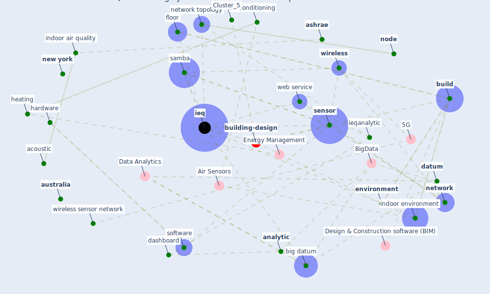

# Article: Continuous IEQ monitoring system: Context and development (parkinson_continuous_2019)

* Source: [10.1016/j.buildenv.2018.12.010](https://doi.org/10.1016/j.buildenv.2018.12.010)
* Year: 2019
* Cluster: [building-design](cluster_5)

## Keywords

 * acoustic, [air conditioning](keyword_air_conditioning), american, [analytic](keyword_analytic), arduino, aren, [ashrae](keyword_ashrae), [australia](keyword_australia), [big datum](keyword_big_datum), bright, [build](keyword_build), build engineering, buildenv, [building](keyword_building), building and environment, cibse, civil, cloud computing, comfort, [compliance](keyword_compliance), copenhagen, dashboard, database, [datum](keyword_datum), datum mining, datum processing, dc, de dear, [denmark](keyword_denmark), [domain](keyword_domain), economist, [environment](keyword_environment), escholarship, floor, fluid dynamic, gateway device, georgia, good, hardware, heating, [ieq](keyword_ieq), ieq rating, ieqanalytic, [indoor air quality](keyword_indoor_air_quality), [indoor environment](keyword_indoor_environment), [information](keyword_information), [internet of thing](keyword_internet_of_thing), iq, main unit, measurement, mesh network, microcontroller, [monitor](keyword_monitor), monitoring station, moscow, naber, [network](keyword_network), network topology, [new york](keyword_new_york), [node](keyword_node), noncompliant, occupant survey, performance, performance system, [protocol](keyword_protocol), [research](keyword_research), roussac, [samba](keyword_samba), [sample](keyword_sample), sample routine, satellite unit, schiavon, [sensor](keyword_sensor), sensor network, [server](keyword_server), software, standards australia, [sydney](keyword_sydney), theory, thesis, time serie, trans acm, transmitter, ubiquitous computing, [united kingdom](keyword_united_kingdom), university of california, university of sydney, [usa](keyword_usa), v soebarto, [ventilation](keyword_ventilation), wan, [washington](keyword_washington), web service, [wellbee](keyword_wellbee), [wireless](keyword_wireless), wireless network, wireless sensor network, wpan, wu, zone

## Concepts

 

## Neighbours

### Closest articles

* An Intelligent IEQ Monitoring and Feedback System: Development and Applications - [LINK](article_geng_intelligent_2021)
* Scalable IoT Architecture for Monitoring IEQ Conditions in Public and Private Buildings - [LINK](article_calvo_scalable_2022)
* A comprehensive review on indoor air quality monitoring systems for enhanced public health - [LINK](article_saini_comprehensive_2020)
* The contribution of green buildings in the fight against COVID-19 - [LINK](article_world_green_building_council_contribution_2020)
*  - [LINK](article_yakubu_aminu_dodo_green_2020)
* Indoor Air Quality: Rethinking rules of building design strategies in post-pandemic architecture - [LINK](article_megahed_indoor_2021)
* Characterization and performance evaluation of a full-scale activated carbon-based dynamic botanical air filtration system for improving indoor air quality - [LINK](article_wang_characterization_2011)
* Emerging from Lockdown: CIBSE COVID-19 Guidance - [LINK](article_cibse_emerging_2020)
* Designing Post COVID-19 Buildings: Approaches for Achieving Healthy Buildings - [LINK](article_navaratnam_designing_2022)

### Closest BPs

* Blueprint: Indoor Environmental Quality (IEQ) monitoring system - [LINK](bp_3)
* Blueprint: Air Cleaning Plants - [LINK](bp_15)
* Blueprint: Tracking and enforcing use of Personal Protective Equipment - [LINK](bp_23)
