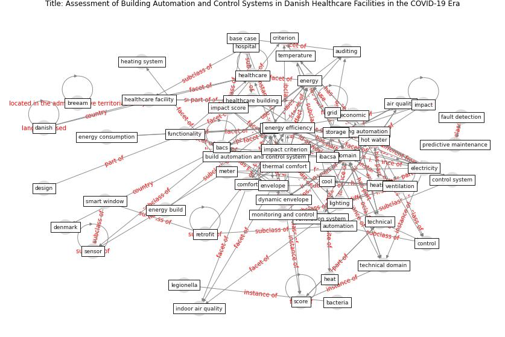

# Article: __Assessment of Building Automation and Control Systems in Danish Healthcare Facilities in the COVID-19 Era__ (pedersen_assessment_2022)

* [10.3390/app12010427](https://doi.org/10.3390/app12010427)
* Cluster: [building-space](cluster_7)

## Keywords

[domain](keyword_domain), [ventilation](keyword_ventilation), [build](keyword_build), [control](keyword_control)

## Abstract

A well-designed and properly operated building automation
and control system (BACS) is key to attaining
energy-efficient operation and optimal indoor conditions.
In this study, three healthcare facilities of a different
type, age, and use are considered as case studies to
investigate the functionalities of BACS in providing
optimal air quality and thermal comfort. IBACSA, the
first-of-its-kind instrument for BACS assessment and
smartness evaluation, is used to evaluate the current
systems and their control functionalities. The BACS
assessment is reported and analyzed. Then, three packages
of improvements were implemented in the three cases,
focusing on (1) technical systems enhancement, (2) indoor
air quality and comfort, and (3) energy efficiency. It was
found that the ventilation system domain is the best
performer in the three considered cases with an overall
score of 52\%, 89\% and 91\% in Case A, B, and C,
respectively. On the other hand, domestic hot water domain
scores are relatively low, indicating that this is an area
where Danish healthcare facilities need to provide more
concentration on. A key finding indicated by the assessment
performed is that the three buildings score relatively very
low when it comes to the impact criteria of energy
flexibility and storage.

## Concepts

 

### References 

* [A critical analysis of the impacts of COVID-19 on the
global economy and ecosystems and opportunities for
circular economy strategies](article_ibn-mohammed_critical_2021)

### Cited by 

