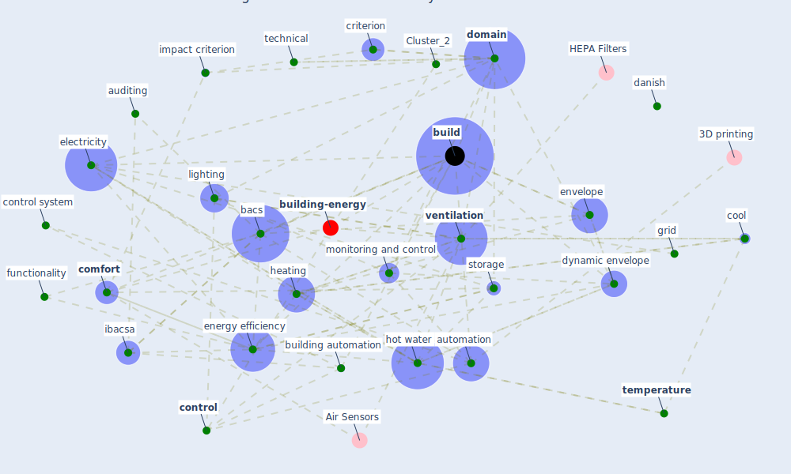

# Article: Assessment of Building Automation and Control Systems in Danish Healthcare Facilities in the COVID-19 Era (pedersen_assessment_2022)

* Source: [10.3390/app12010427](https://doi.org/10.3390/app12010427)
* Year: 2022
* Cluster: [building-design](cluster_5)

## Keywords

 * air quality, appl in, assessment, auditing, automation, [bacs](keyword_bacs), [bacteria](keyword_bacteria), bar, base case, blind, [breeam](keyword_breeam), [build](keyword_build), build automation and control, build automation and control system, build j, [building](keyword_building), building automation, building management system, building service, case c, comfort, [control](keyword_control), control system, cool, cool system, criterion, [danish](keyword_danish), [denmark](keyword_denmark), [design](keyword_design), diagnostic, district heating, [domain](keyword_domain), dynamic envelope, [economic](keyword_economic), electricity, electricity consumption, electricity generation, [energy](keyword_energy), energy build, [energy consumption](keyword_energy_consumption), [energy efficiency](keyword_energy_efficiency), energy reduction, envelope, eu bac system, evaluation, fault detection, first phase, flexibility, functionality, grid, [healthcare](keyword_healthcare), healthcare building, healthcare facility, heat, heating, heating system, heating system domain, [hospital](keyword_hospital), hot water, ia, [ibacsa](keyword_ibacsa), [impact](keyword_impact), impact criterion, impact point, impact score, [indoor air quality](keyword_indoor_air_quality), information collection, java, jradi, [leed](keyword_leed), legionella, lighting, locally produce electricity, maintenance, meter, methodology, monitoring and control, percentage, predictive maintenance, pump, retrofit, [room](keyword_room), [russia](keyword_russia), score, [sensor](keyword_sensor), [service](keyword_service), setpoint, [smart building](keyword_smart_building), smart window, smartness evaluation, software, [standard](keyword_standard), storage, [switzerland](keyword_switzerland), technical, [temperature](keyword_temperature), time schedule, [ventilation](keyword_ventilation), ventilation system, [window](keyword_window)

## Concepts

 

## Neighbours

### Closest articles

* Reflecting on Impacts of COVID19 on Sustainable Buildings and Cities - [LINK](article_gonzalez_reflecting_2021)
* The effect of occupant distribution on energy consumption and COVID-19 infection in buildings: A case study of university building - [LINK](article_mokhtari_effect_2021)
* Occupants’ behavior and activity patterns influencing the energy consumption in the Kuwaiti residences - [LINK](article_al-mumin_occupants_2003)
* Addressing the impact of COVID-19 lockdown on energy use in municipal buildings: A case study in Florianópolis, Brazil - [LINK](article_geraldi_addressing_2021)
* Impacts of COVID-19 on residential building energy use and performance - [LINK](article_kawka_impacts_2021)
*  - [LINK](article_yakubu_aminu_dodo_green_2020)
* The contribution of green buildings in the fight against COVID-19 - [LINK](article_world_green_building_council_contribution_2020)
* Contextualizing the Covid-19 pandemic for a carbon-constrained world: Insights for sustainability transitions, energy justice, and research methodology - [LINK](article_sovacool_contextualizing_2020)

### Closest BPs

* Blueprint: Monitoring of wastewater - [LINK](bp_21)
* Blueprint: Indoor Environmental Quality (IEQ) monitoring system - [LINK](bp_3)
* Blueprint: Air Cleaning Plants - [LINK](bp_15)
