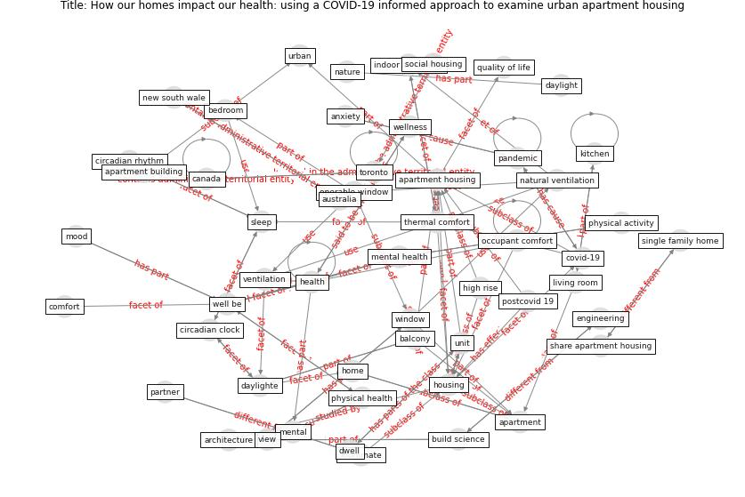

# Article: __How our homes impact our health: using a COVID-19 informed approach to examine urban apartment housing__ (peters_how_2020)

* [10.1108/ARCH-08-2020-0159](https://doi.org/10.1108/ARCH-08-2020-0159)
* Cluster: [building-space](cluster_8)

## Keywords

[housing](keyword_housing), [balcony](keyword_balcony), [health](keyword_health), [pandemic](keyword_pandemic), [home](keyword_home), [apartment](keyword_apartment)

## Abstract

Purpose The COVID-19 global health crisis is undeniably a
global housing crisis. Our study focuses on quality of life
in urban mid- and high-rise apartment housing, the fastest
growing housing types in many cities around the world. This
housing typology presents unique challenges relating to
connection to nature, daylight and fresh air.

Design/methodology/approach This multi-disciplinary
literature review analyzes more than 100 published papers
from peer-reviewed sources from environmental psychology,
building science and architecture relevant to quality of
life in high-rise housing, as well as more than 40 recent
newspaper and magazine articles about the possible impacts
of COVID-19 on housing. We identify synergies between
passive design strategies and health-promoting architecture
or “restorative environmental design” principles.

Findings Post-pandemic, health-promoting apartment housing
design must prioritize (1) window placement and views that
support stress recovery and restoration; (2) lighting
levels based on spaces that can satisfy multiple uses and
users; (3) bedrooms designed for restful sleep that
contribute to circadian regulation; (4) living rooms with
better indoor air quality, with a focus on natural
ventilation; (5) access to nature, through the purposeful
design of balconies and (6) unit sizes and layouts that
enable physical distancing and prevent crowding.

Originality/value We identify new social and environmental
design priorities in the form of evidence-based design
principles to inform and promote healthy and restorative
living environments for residents in apartment housing.

## Concepts

 

