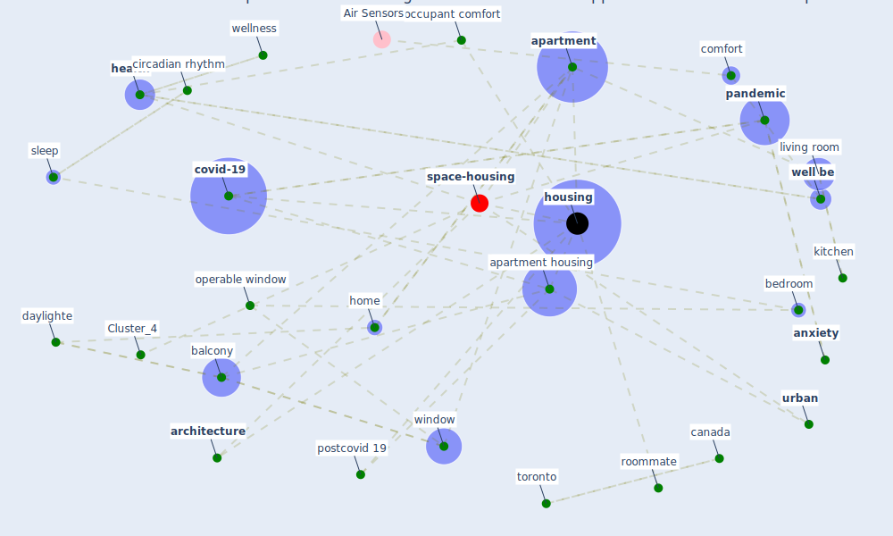

# Article: How our homes impact our health: using a COVID-19 informed approach to examine urban apartment housing (peters_how_2020)

* Source: [10.1108/ARCH-08-2020-0159](https://doi.org/10.1108/ARCH-08-2020-0159)
* Year: 2020
* Cluster: [housing-space](cluster_14)

## Keywords

 * active building system, active heating and cool system, affordable housing, [anxiety](keyword_anxiety), [apartment](keyword_apartment), apartment building, apartment housing, [architecture](keyword_architecture), architizer, [australia](keyword_australia), [balcony](keyword_balcony), [bedroom](keyword_bedroom), [build](keyword_build), build science, [canada](keyword_canada), cbc, circadian clock, circadian regulation, circadian rhythm, [comfort](keyword_comfort), [country](keyword_country), [covid 19 crisis](keyword_covid_19_crisis), [covid-19](keyword_covid-19), cuba, daylight, daylighte, [design](keyword_design), designer, [disease](keyword_disease), door handle, dwell, elevator, elevator button, enclosure, [engineering](keyword_engineering), [environment](keyword_environment), floor plan, fresh air, [health](keyword_health), high rise, [home](keyword_home), [hong kong](keyword_hong_kong), [housing](keyword_housing), housing typology, hwang j, kesik, kitchen, lee h, literature review, living room, [lockdown](keyword_lockdown), [london](keyword_london), [loneliness](keyword_loneliness), mak, [manhattan](keyword_manhattan), melatonin, mood, more frequent and severe weather event, naturalness, [nature](keyword_nature), [new south wale](keyword_new_south_wale), nighttime, o brien, [occupant](keyword_occupant), occupant comfort, one bedroom, openness, operable window, ottawa, paimio sanatorium, [pandemic](keyword_pandemic), partner, passive design, passive survivability, post covid 19, postcovid 19, quality of life, refuge, restful sleep, restorative, [room](keyword_room), roommate, ryerson university, share apartment housing, share unit, single family home, [sleep](keyword_sleep), summer, [toronto](keyword_toronto), two bedroom, unit, [urban](keyword_urban), urban densification, urban farming, [ventilation](keyword_ventilation), view, [well be](keyword_well_be), wellness, [window](keyword_window), xue

## Concepts

 

## Neighbours

### Closest articles

* Towards Resilient Residential Buildings and Neighborhoods in Light of COVID-19 Pandemic—The Scenario of Podgorica, Montenegro - [LINK](article_bojovic_towards_2022)
* Prophylactic Architecture: Formulating the Concept of Pandemic-Resilient Homes - [LINK](article_elrayies_prophylactic_2022)
*  - [LINK](article_dalessandro_covid-19_2020)
* COVID-19 and Green Housing: A Review of Relevant Literature - [LINK](article_kaklauskas_covid-19_2021)
* How is COVID-19 Experience Transforming Sustainability Requirements of Residential Buildings? A Review - [LINK](article_tokazhanov_how_2020)
* RESIDENTIAL ARCHITECTURE IN A POST-PANDEMIC WORLD: IMPLICATIONS OF COVID-19 FOR NEW CONSTRUCTION AND FOR ADAPTING HERITAGE BUILDINGS - [LINK](article_spennemann_residential_2021)
* Designing for COVID-2x: Reflecting on Future-Proofing Human Habitation for the Inevitable Next Pandemic - [LINK](article_spennemann_designing_2022)
* Adaptive Design of the Built Environment to Mitigate the Transmission Risk of COVID-19 - [LINK](article_ara_dilshad_shangi_adaptive_2020)
* COVID-19 Could Leverage a Sustainable Built Environment - [LINK](article_pinheiro_covid-19_2020)
* The COVID-19 Impact on Flexible Office Space - [LINK](article_clifton_covid-19_2020)

### Closest BPs

* Blueprint: Building Adaptation during a pandemic - [LINK](bp_14)
* Blueprint: Tracking and enforcing use of Personal Protective Equipment - [LINK](bp_23)
* Blueprint: Architecture design - [LINK](bp_2)
