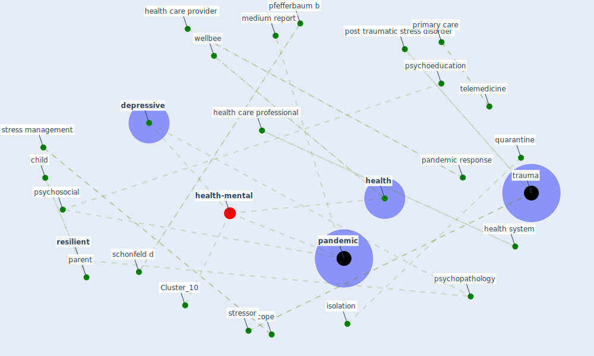

# Article: Mental Health and the Covid-19 Pandemic (pfefferbaum_mental_2020)

* Source: [10.1056/NEJMp2008017](https://doi.org/10.1056/NEJMp2008017)
* Year: 2020
* Cluster: [health-city](cluster_1)

## Keywords

 * 2003 sar outbreak, american psychiatric association, [anxiety](keyword_anxiety), anxiety disorder, [arlington](keyword_arlington), arlington va, biosecur, biosecur bioterror, bioterror, [child](keyword_child), cope, current, current pandemic, [depression](keyword_depression), depressive, diagnostic, disaster, emotional, h1n1 crisis, [health](keyword_health), [health care](keyword_health_care), health care professional, health care provider, health care system, [health system](keyword_health_system), home confinement, home confinement of large swath of the population, isolation, medium, medium report, new strength, [news](keyword_news), oklahoma city, [pandemic](keyword_pandemic), pandemic response, parent, pfefferbaum b, post traumatic stress disorder, primary care, provider, psychiatric, psychoeducation, [psychopathology](keyword_psychopathology), [psychosocial](keyword_psychosocial), public health crisis, [quarantine](keyword_quarantine), resilient, schonfeld d, strength, [stress](keyword_stress), stress management, stressor, stressor relate disorder, [telemedicine](keyword_telemedicine), [toronto](keyword_toronto), [trauma](keyword_trauma), [unesco](keyword_unesco), university of oklahoma, university of oklahoma health sciences center, [vaccine](keyword_vaccine), vaccine availability, vaccine availability and acceptability, [wellbee](keyword_wellbee), [world heritage site](keyword_world_heritage_site)

## Concepts

 

## Neighbours

### Closest articles

* Mental health and COVID-19 - [LINK](article_who_mental_2021)
* Psychological Effects of Home Confinement and Social Distancing Derived from COVID-19 in the General Population—A Systematic Review - [LINK](article_rodriguez-fernandez_psychological_2021)
* The psychological impact of COVID-19 on the mental health in the general population - [LINK](article_serafini_psychological_2020)
* Home garden use during COVID-19: Associations with physical and mental wellbeing in older adults - [LINK](article_corley_home_2021)
* COVID-19 Lockdown: Housing Built Environment’s Effects on Mental Health - [LINK](article_amerio_covid-19_2020)
* Mental health economics: A prospective study on psychological flourishing and associations with healthcare costs and sickness benefit transfers in Denmark - [LINK](article_santini_mental_2021)
* COVID-19 media fatigue: predictors of decreasing interest and avoidance of COVID-19–related news - [LINK](article_buneviciene_covid-19_2021)
* The impacts of knowledge, risk perception, emotion and information on citizens’ protective behaviors during the outbreak of COVID-19: a cross-sectional study in China - [LINK](article_ning_impacts_2020)
* What drives unverified information sharing and cyberchondria during the COVID-19 pandemic? - [LINK](article_laato_what_2020)
* The changes in the effects of social media use of Cypriots due to COVID-19 pandemic - [LINK](article_kaya_changes_2020)

### Closest BPs

* Blueprint: Resilience in staffing and skills training - [LINK](bp_12)
* Blueprint: Installing high-efficiency air filters - [LINK](bp_11)
* Blueprint: Air Cleaning Plants - [LINK](bp_15)
