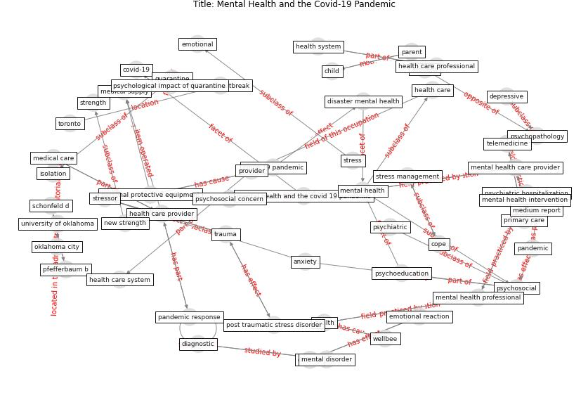

# Article: Mental Health and the Covid-19 Pandemic (pfefferbaum_mental_2020)

* Source: [10.1056/NEJMp2008017](https://doi.org/10.1056/NEJMp2008017)
* Year: 2020
* Cluster: [health-mental](cluster_15)

## Keywords

 * 2003 sar outbreak, american psychiatric association, [anxiety](keyword_anxiety), anxiety disorder, [arlington](keyword_arlington), arlington va, biosecur, biosecur bioterror, bioterror, [child](keyword_child), cope, current, current pandemic, [depression](keyword_depression), [depressive](keyword_depressive), diagnostic, disaster, emotional, h1n1 crisis, [health](keyword_health), [health care](keyword_health_care), health care professional, health care provider, health care system, [health system](keyword_health_system), home confinement, home confinement of large swath of the population, isolation, medium, medium report, new strength, [news](keyword_news), oklahoma city, [pandemic](keyword_pandemic), pandemic response, parent, pfefferbaum b, post traumatic stress disorder, primary care, provider, psychiatric, psychoeducation, [psychopathology](keyword_psychopathology), [psychosocial](keyword_psychosocial), public health crisis, quarantine, resilient, schonfeld d, strength, [stress](keyword_stress), stress management, stressor, stressor relate disorder, [telemedicine](keyword_telemedicine), [toronto](keyword_toronto), [trauma](keyword_trauma), [unesco](keyword_unesco), university of oklahoma, university of oklahoma health sciences center, [vaccine](keyword_vaccine), vaccine availability, vaccine availability and acceptability, [wellbee](keyword_wellbee), [world heritage site](keyword_world_heritage_site)

## Concepts

 

## Neighbours

### Closest articles

* Mental health and COVID-19 - [LINK](article_who_mental_2021)
* The psychological impact of COVID-19 on the mental health in the general population - [LINK](article_serafini_psychological_2020)
* Psychological Effects of Home Confinement and Social Distancing Derived from COVID-19 in the General Population—A Systematic Review - [LINK](article_rodriguez-fernandez_psychological_2021)
* Home garden use during COVID-19: Associations with physical and mental wellbeing in older adults - [LINK](article_corley_home_2021)
* A Mixed Approach on Resilience of Spanish Dwellings and Households during COVID-19 Lockdown - [LINK](article_cuerdo-vilches_mixed_2020)
* COVID-19 Lockdown: Housing Built Environment’s Effects on Mental Health - [LINK](article_amerio_covid-19_2020)
* Questioning the use of the balcony in apartments during the COVID-19 pandemic process - [LINK](article_aydin_questioning_2020)
* How will COVID-19 change future building regulations? - [LINK](article_hmc_architects_how_2020)
* Attitudes towards outdoor and neighbour noise during the COVID-19 lockdown: A case study in London - [LINK](article_lee_attitudes_2021)

### Closest BPs

* Blueprint: Architecture design - [LINK](bp_2)
* Blueprint: Building Adaptation during a pandemic - [LINK](bp_14)
* Blueprint: Tender support at building stage - [LINK](bp_9)
