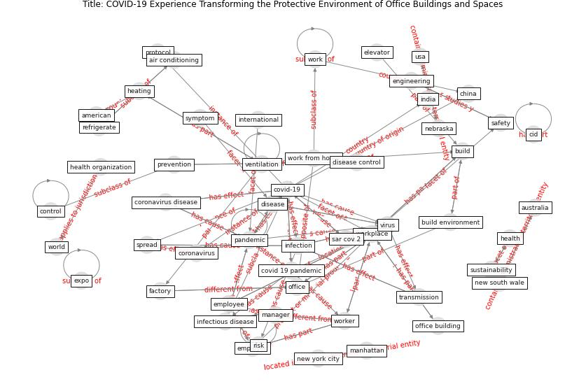

# Article: __COVID-19 Experience Transforming the Protective Environment of Office Buildings and Spaces__ (phapant_covid-19_2021)

* [10.3390/su132413636](https://doi.org/10.3390/su132413636)
* Cluster: [building-space](cluster_7)

## Keywords

[virus](keyword_virus), [pandemic](keyword_pandemic), [infection](keyword_infection), [worker](keyword_worker), [office](keyword_office), [coronavirus](keyword_coronavirus), [ventilation](keyword_ventilation)

## Abstract

The COVID-19 pandemic has affected human life in every
possible way and, alongside this, the need has been felt
that office buildings and workplaces must have protective
and preventive layers against COVID-19 transmission so that
a smooth transition from ‘work from home’ to ‘work
from office’ is possible. However, a comprehensive
understanding of how the protective environment can be
built around office buildings and workspaces, based on the
year-long experience of living with COVID-19, is largely
absent. The present study reviews international agency
regulation, country regulation, updated journal articles,
etc., to critically understand lessons learned from the
COVID-19 pandemic and evaluate the expected changes in
sustainability requirements of office buildings and
workplaces. The built environment, control environment, and
regulatory environment around office buildings and
workplaces have been put under test on safety grounds
during the pandemic. Workers switched over to safely work
from home. Our findings bring out the changes required to
be affected in the three broad environmental dimensions to
limit their vulnerability status experienced during the
pandemic. Office building designs should be fundamentally
oriented to provide certain safety protective measures to
the workers, such as touch-free technologies, open working
layouts, and workplace flexibilities to diminish the
probability of getting infected. Engineering and
administrative control mechanisms should work in a
complementary way to eliminate the risk of disease spread.
Country regulation, agency regulations, and operational
guidelines need to bring behavioral changes required to
protect workers from the COVID-19 pandemic.

## Concepts

 

### References 

* [Antivirus-built environment: Lessons learned from
Covid-19 pandemic](article_megahed_antivirus-built_2020)
* [2019 Novel Coronavirus (COVID-19) Pandemic:
Built Environment Considerations To Reduce
Transmission](article_dietz_2019_2020)
* [Ten questions concerning occupant health in buildings
during normal operations and extreme events including the
COVID-19 pandemic](article_awada_ten_2021)

### Cited by 

