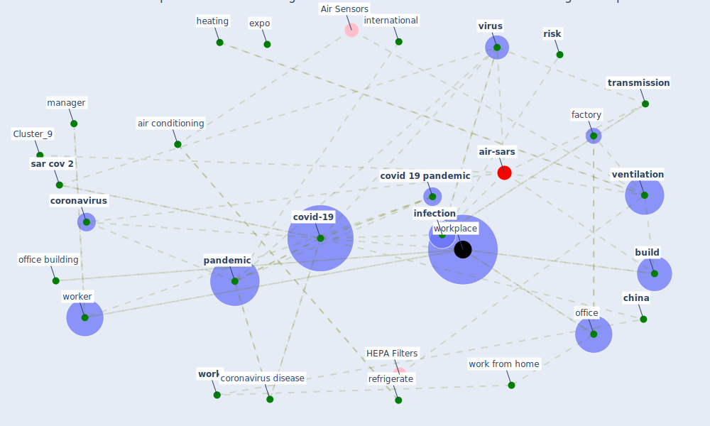

# Article: COVID-19 Experience Transforming the Protective Environment of Office Buildings and Spaces (phapant_covid-19_2021)

* Source: [10.3390/su132413636](https://doi.org/10.3390/su132413636)
* Year: 2021
* Cluster: [air-sars](cluster_9)

## Keywords

 * [aerosol](keyword_aerosol), agency regulation, [air conditioning](keyword_air_conditioning), airborne transmission, american, antivirus, [architecture](keyword_architecture), [ashrae](keyword_ashrae), [australia](keyword_australia), [beijing](keyword_beijing), [build](keyword_build), [build environment](keyword_build_environment), centre for disease prevention and control, [china](keyword_china), chulalongkorn university, [cid](keyword_cid), [clean](keyword_clean), [control](keyword_control), [coronavirus](keyword_coronavirus), coronavirus disease, cough, country regulation, [covid 19 pandemic](keyword_covid_19_pandemic), [covid-19](keyword_covid-19), cybersecurity, [denmark](keyword_denmark), [design](keyword_design), [disease](keyword_disease), disease control, elevator, [employee](keyword_employee), [employer](keyword_employer), [engineering](keyword_engineering), engineering control, equipment, [europe](keyword_europe), expo, [factory](keyword_factory), [gerba](keyword_gerba), global, [health](keyword_health), health organization, heating, houston, hygiene, [india](keyword_india), [infection](keyword_infection), infectious, [infectious disease](keyword_infectious_disease), international, [korea](keyword_korea), labour organization, legionella, [lockdown](keyword_lockdown), [management](keyword_management), [manager](keyword_manager), [manhattan](keyword_manhattan), national, nebraska, [new south wale](keyword_new_south_wale), [new york city](keyword_new_york_city), nordic country, [office](keyword_office), office building, pamidimukkala, [pandemic](keyword_pandemic), [prevention](keyword_prevention), [protocol](keyword_protocol), [public health](keyword_public_health), [public space](keyword_public_space), refrigerate, regulation, [risk](keyword_risk), [russia](keyword_russia), [safety](keyword_safety), [sar cov 2](keyword_sar_cov_2), shahzad, [shanghai](keyword_shanghai), singapore, source control, [spread](keyword_spread), st petersburg, staircase, [surface](keyword_surface), [sustainability](keyword_sustainability), [switzerland](keyword_switzerland), [symptom](keyword_symptom), [temperature](keyword_temperature), [transmission](keyword_transmission), [usa](keyword_usa), [ventilation](keyword_ventilation), [virus](keyword_virus), [work](keyword_work), work from home, [worker](keyword_worker), [workplace](keyword_workplace), world, [world health organization](keyword_world_health_organization), [world heritage site](keyword_world_heritage_site), yifang

## Concepts

 

## Neighbours

### Closest articles

* A study on office workplace modification during the COVID-19 pandemic in The Netherlands - [LINK](article_hou_study_2021)
* It’s time to reimagine where and how work will get done (PwC’s US Remote Work Survey) - [LINK](article_pricewaterhousecoopers_its_2021)
* Health, Wellbeing \& Productivity in Offices - [LINK](article_world_green_building_council_health_2014)
* The COVID-19 Impact on Flexible Office Space - [LINK](article_clifton_covid-19_2020)
* Occupant health in buildings: Impact of the COVID-19 pandemic on the opinions of building professionals and implications on research - [LINK](article_awada_occupant_2022)
* Ten questions concerning occupant health in buildings during normal operations and extreme events including the COVID-19 pandemic - [LINK](article_awada_ten_2021)
* Smart buildings: how a virus might lead to healthier buildings - Arup - [LINK](article_lam_smart_2021)
* Architectural Design Drives the Biogeography of Indoor Bacterial Communities - [LINK](article_kembel_architectural_2014)
* The contribution of green buildings in the fight against COVID-19 - [LINK](article_world_green_building_council_contribution_2020)
* Designing Post COVID-19 Buildings: Approaches for Achieving Healthy Buildings - [LINK](article_navaratnam_designing_2022)

### Closest BPs

* Blueprint: Building Adaptation during a pandemic - [LINK](bp_14)
* Blueprint: Architecture design - [LINK](bp_2)
* Blueprint: Tracking and enforcing use of Personal Protective Equipment - [LINK](bp_23)
