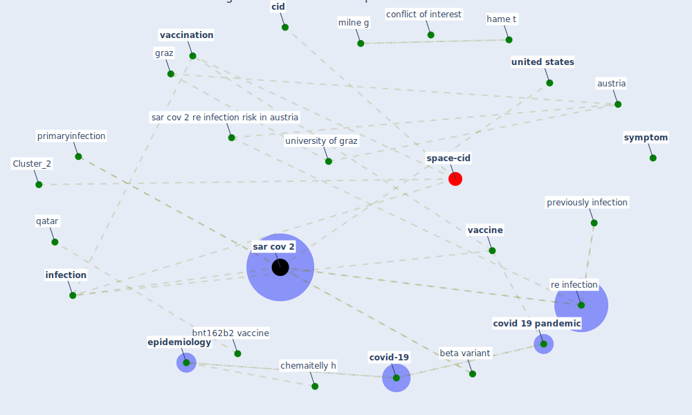

# Article: Contributions to the mitigation of the COVID-19 pandemic (pilz_contributions_2022)

* Source: [10.1093/cid/ciac033](https://doi.org/10.1093/cid/ciac033)
* Year: 2022
* Cluster: [space-cid](cluster_2)

## Keywords

 * 2008 summer olympic, a large survey, abu raddad lj, [ac](keyword_ac), academia, academic, all right reserve, [austria](keyword_austria), [beijing](keyword_beijing), beta variant, bnt162b2 vaccine, chemaitelly h, [china](keyword_china), [cid](keyword_cid), clin infect dis, clinic infect dis, [conflict of interest](keyword_conflict_of_interest), [covid 19 pandemic](keyword_covid_19_pandemic), covid 19 vaccine effectiveness in new york state, [covid-19](keyword_covid-19), delta variant, [denmark](keyword_denmark), dorabawila v, email, [epidemiology](keyword_epidemiology), es, estimate we infection and vaccineinduce sar cov 2 seroprevalence base on blood donation, first sar cov 2 infection, graz, graz austria, hame t, hasan mr, [health](keyword_health), [health system](keyword_health_system), infect dis, [infection](keyword_infection), infectious disease society of america, infectious disease society ofamerica, ioannidis, jones jm stone, jones jm stone m, journal permission oup com, jpa, kim et, kim et c, large survey, milne g, mr, new york state, no conflict of interest, overall protection, oxford university press, partially vaccinate, peke university, people s republic of china, previously infection, primaryinfection, protection, protection against re infection, protection against sar cov 2 infection in qatar, qatar, re infect, re infected patient, [re infection](keyword_re_infection), re infection risk, reinfection, [research](keyword_research), rosenberg, rosenberg es, [sar cov 2](keyword_sar_cov_2), sar cov 2 infection, sar cov 2 infection in qatar, sar cov 2 re infection risk in austria, sar cov 2 reinfection, sar cov 2 reinfection as compare with primaryinfection, sar cov 2 reinfection as compare with sar cov 2 reinfection, sar cov 2 seroprevalence, sar cov 2 seroprevalence base on blood donation, secondary outcome analysis, sulaeman h, [symptom](keyword_symptom), tang p, unclear vaccination status, [united states](keyword_united_states), university of graz, university of oxford, vaccinate, [vaccination](keyword_vaccination), [vaccine](keyword_vaccine), we infection and vaccineinduce sar cov 2 seroprevalence base on blood donation

## Concepts

 

## Neighbours

### Closest articles

* Physical interventions to interrupt or reduce the spread of respiratory viruses: systematic review - [LINK](article_jefferson_physical_2008)
* COVID-19 Prevention and Control Measures in Workplace Settings: A Rapid Review and Meta-Analysis - [LINK](article_ingram_covid-19_2021)
* SARS-CoV-2 in wastewater: potential health risk, but also data source - [LINK](article_lodder_sars-cov-2_2020)
* COVID-19: Risk assessment and mitigation measures in healthcare and non-healthcare workplaces - [LINK](article_fawzy_covid-19_2021)
* Wastewater surveillance for population-wide Covid-19: The present and future - [LINK](article_daughton_wastewater_2020)
* Significant applications of virtual reality for COVID-19 pandemic - [LINK](article_singh_significant_2020)
* COVID-19 Pandemic: Prevention and Protection Measures to Be Adopted at the Workplace - [LINK](article_cirrincione_covid-19_2020)
* Current knowledge of COVID-19: Advances, challenges and future perspectives - [LINK](article_wu_current_2021)
* COVID-19 and its Modes of Transmission - [LINK](article_karia_covid-19_2020)

### Closest BPs

* Blueprint: Resilience in staffing and skills training - [LINK](bp_12)
* Blueprint: Negative pressure rooms - [LINK](bp_13)
* Blueprint: Smart Locker System - [LINK](bp_1)
