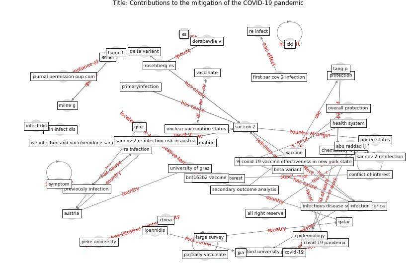

# Article: Contributions to the mitigation of the COVID-19 pandemic (pilz_contributions_2022)

* Source: [10.1093/cid/ciac033](https://doi.org/10.1093/cid/ciac033)
* Year: 2022
* Cluster: [health-patient](cluster_14)

## Keywords

 * 2008 summer olympic, a large survey, abu raddad lj, ac, academia, [academic](keyword_academic), all right reserve, [austria](keyword_austria), [beijing](keyword_beijing), beta variant, bnt162b2 vaccine, chemaitelly h, [china](keyword_china), cid, clin infect dis, clinic infect dis, [conflict of interest](keyword_conflict_of_interest), [covid 19 pandemic](keyword_covid_19_pandemic), covid 19 vaccine effectiveness in new york state, [covid-19](keyword_covid-19), delta variant, [denmark](keyword_denmark), dorabawila v, [email](keyword_email), [epidemiology](keyword_epidemiology), es, estimate we infection and vaccineinduce sar cov 2 seroprevalence base on blood donation, first sar cov 2 infection, graz, graz austria, hame t, hasan mr, [health](keyword_health), [health system](keyword_health_system), infect dis, [infection](keyword_infection), infectious disease society of america, infectious disease society ofamerica, ioannidis, jones jm stone, jones jm stone m, journal permission oup com, jpa, kim et, kim et c, large survey, milne g, mr, new york state, no conflict of interest, overall protection, oxford university press, partially vaccinate, peke university, people s republic of china, previously infection, primaryinfection, protection, protection against re infection, protection against sar cov 2 infection in qatar, qatar, re infect, re infected patient, [re infection](keyword_re_infection), re infection risk, reinfection, [research](keyword_research), rosenberg, rosenberg es, [sar cov 2](keyword_sar_cov_2), sar cov 2 infection, sar cov 2 infection in qatar, sar cov 2 re infection risk in austria, sar cov 2 reinfection, sar cov 2 reinfection as compare with primaryinfection, sar cov 2 reinfection as compare with sar cov 2 reinfection, sar cov 2 seroprevalence, sar cov 2 seroprevalence base on blood donation, secondary outcome analysis, sulaeman h, [symptom](keyword_symptom), tang p, unclear vaccination status, [united states](keyword_united_states), university of graz, university of oxford, vaccinate, vaccination, [vaccine](keyword_vaccine), we infection and vaccineinduce sar cov 2 seroprevalence base on blood donation

## Concepts

 

## Neighbours

### Closest articles

* The impact of COVID-19 and strategies for mitigation and suppression in low- and middle-income countries - [LINK](article_walker_impact_2020)
* Coronavirus disease 2019: The harms of exaggerated information and non‐evidence‐based measures - [LINK](article_ioannidis_coronavirus_2020)
* Climate and the spread of COVID-19 - [LINK](article_chen_climate_2021)
* Covid-19 and community mitigation strategies in a pandemic - [LINK](article_ebrahim_covid-19_2020)
* The Socio-Spatial Determinants of COVID-19 Diffusion: The Impact of Globalisation, Settlement Characteristics and Population - [LINK](article_sigler_socio-spatial_2020)
* Knowledge, attitudes, and practices of Indonesian residents regarding COVID-19: A national cross-sectional survey - [LINK](article_yodang_knowledge_2021)
* COVID-19 and social inequalities: a complex and dynamic interaction - [LINK](article_quantin_covid-19_2022)
* Study of COVID-19 pandemic in London (UK) from urban context - [LINK](article_ghosh_study_2020)
* The impacts of knowledge, risk perception, emotion and information on citizens’ protective behaviors during the outbreak of COVID-19: a cross-sectional study in China - [LINK](article_ning_impacts_2020)
* COVID-19 and the rise of intimate partner violence - [LINK](article_aguero_covid-19_2021)

### Closest BPs

* Blueprint: Resilience in staffing and skills training - [LINK](bp_12)
* Blueprint: Monitoring of wastewater - [LINK](bp_21)
* Blueprint: Architecture design - [LINK](bp_2)
