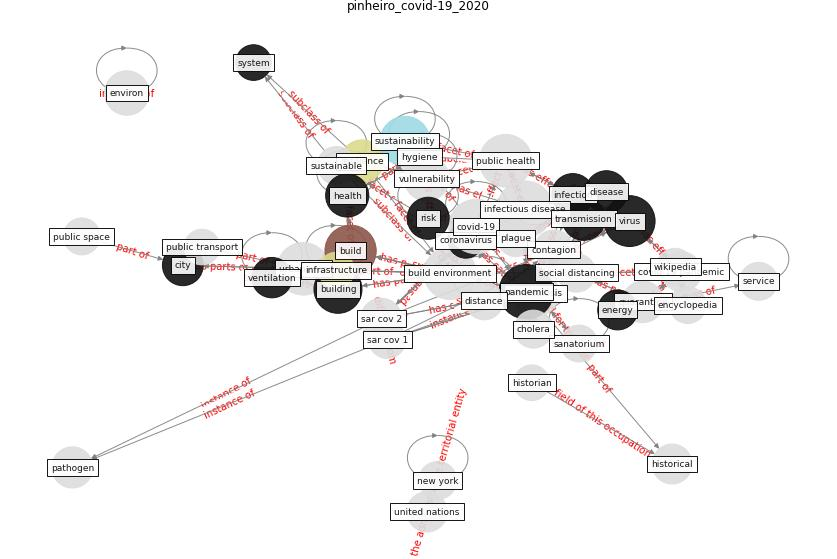

# Article: __COVID-19 Could Leverage a Sustainable Built Environment__ (pinheiro_covid-19_2020)

* [10.3390/su12145863](https://doi.org/10.3390/su12145863)
* Cluster: [building-space](cluster_7)

## Keywords

[pandemic](keyword_pandemic), [build](keyword_build), [building](keyword_building), [virus](keyword_virus), [transmission](keyword_transmission), [health](keyword_health), [resilience](keyword_resilience)

## Abstract

The health system’s response to the COVID-19 pandemic
has involved research into diagnoses and vaccines, but
primarily it has required specific treatments, facilities
and equipment, together with the control of individual
behaviour and a period of collective confinement. The aim
of this particular research, therefore, is to discover
whether COVID-19 is capable of changing the built
environment (BE) and leveraging specific solutions for
sustainable buildings or urban areas. Some historical
reviews of infectious pandemics have highlighted the
development of new solutions in the BE as an additional
contribution towards preventing the spread of infection.
The BE has an important role to play in supporting public
health measures and reducing the risk of infections. The
review of potential COVID-19 measures shows the existence
of well-referenced solutions, ranging from incremental
alterations (organisation of spaces, erection of physical
barriers) to structural alterations (windows, balconies)
with different timeframes and scales (ranging from changes
in building materials to the design of urban areas). A
critical exploratory assessment makes it possible to
identify measures that may help not only to reduce the risk
of COVID-19 transmission (or even prevent it), but also to
increase resilience, improve air quality and lower energy
requirements or the use of materials, and thus potentially
increase the sustainability of the BE. COVID-19 measures
challenge us to rethink buildings and urban areas and
potentially leverage sustainable BE solutions with win-win
outcomes (minimalist design and other solutions). The
specific composition of this set of measures must, however,
be further researched.

## Concepts

 

### References 

* [2019 Novel Coronavirus (COVID-19) Pandemic:
Built Environment Considerations To Reduce
Transmission](article_dietz_2019_2020)
* [Persistence of coronaviruses on inanimate surfaces and
their inactivation with biocidal agents](article_kampf_persistence_2020)

### Cited by 

* [A Review on Building Design as a Biomedical
System for Preventing COVID-19 Pandemic](article_amran_review_2022)
* [Prophylactic Architecture: Formulating the Concept
of Pandemic-Resilient Homes](article_elrayies_prophylactic_2022)
* [A critical analysis of the impacts of COVID-19 on the
global economy and ecosystems and opportunities for
circular economy strategies](article_ibn-mohammed_critical_2021)
* [COVID-19 and Green Housing: A Review of
Relevant Literature](article_kaklauskas_covid-19_2021)
* [A Global Survey of Infection Control and
Mitigation Measures for Combating the Transmission
of COVID-19 Pandemic in Buildings Under
Facilities Management Services](article_sarvari_global_2022)
* [Readiness Assessment of Green Building
Certification Systems for Residential Buildings
during Pandemics](article_tleuken_readiness_2021)
* [Impact of COVID-19 on IoT Adoption in Healthcare,
Smart Homes, Smart Buildings, Smart Cities,
Transportation and Industrial IoT](article_umair_impact_2021)
