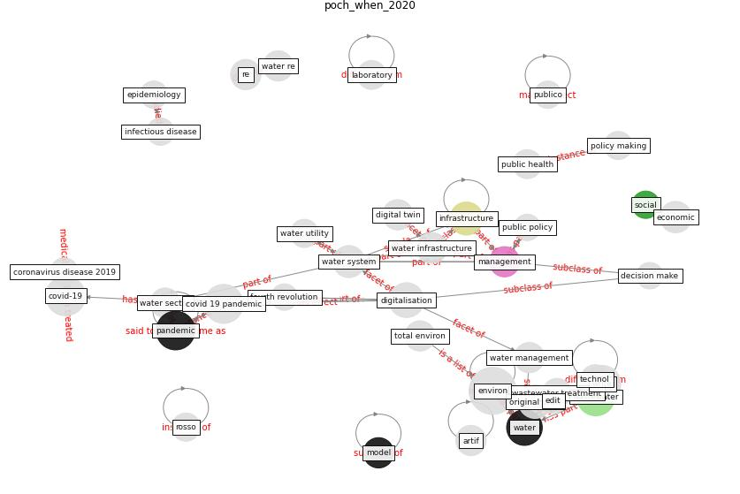

# Article: When the fourth water and digital revolution encountered COVID-19 (poch_when_2020)

* Source: [10.1016/j.scitotenv.2020.140980](https://doi.org/10.1016/j.scitotenv.2020.140980)
* Year: 2020
* Cluster: [city-health](cluster_14)

## Keywords

 * I ii, artif, [artificial intelligence](keyword_artificial_intelligence), [barcelona](keyword_barcelona), big datum analytic, bottled water, [climate change](keyword_climate_change), complexity science, computational model, [coronavirus](keyword_coronavirus), [covid 19 pandemic](keyword_covid_19_pandemic), [covid-19](keyword_covid-19), [datum](keyword_datum), datum analysis, datum quality verification, decision make, develop, develop country, digital revolution, digital system, [digital twin](keyword_digital_twin), [digitalisation](keyword_digitalisation), disinfection by product, ecology, [economic](keyword_economic), effluent, [epidemic](keyword_epidemic), [epidemiology](keyword_epidemiology), [europe](keyword_europe), fourth revolution, fourthrevolution, [france](keyword_france), [genome](keyword_genome), genre, [health](keyword_health), hydrology, hygiene, [impact](keyword_impact), [industry](keyword_industry), [infection](keyword_infection), [infectious disease](keyword_infectious_disease), [infrastructure](keyword_infrastructure), infrastructure design, laboratory, [lockdown](keyword_lockdown), management, [model](keyword_model), nat nat, noriega, palma madrid, [pandemic](keyword_pandemic), [plan](keyword_plan), poch, policy making, [public health](keyword_public_health), public policy, [resilience](keyword_resilience), rosso, s g r a p h, sanitary, sar cov 2 rna, science, science fiction, [sensor](keyword_sensor), [sewage](keyword_sewage), sewer, shortage, smart meter, [social](keyword_social), social simulation, [spain](keyword_spain), [surveillance](keyword_surveillance), tap water, techno economic, technol sci, teleworke, tot barcelonahttps www totbarcelona cat societat barcelonaintrodueix cop taxa residus 225 425 euro llar_2103848102 html, treatment, treatment plant, uncertainty, [united kingdom](keyword_united_kingdom), [united states](keyword_united_states), university of california, [urban](keyword_urban), urban water cycle, utility, value judgment, vanrolleghem, villez, [wastewater](keyword_wastewater), wastewater treatment, wastewater treatment plant, [water](keyword_water), water infrastructure, water management, water sector, water supply, water system, water treatment, water utility

## Concepts

 

## Neighbours

### Closest articles

* An environmental and health perspective for COVID-19 outbreak: Meteorology and air quality influence, sewage epidemiology indicator, hospitals disinfection, drug therapies and recommendations - [LINK](article_barcelo_environmental_2020)
* Future perspectives of wastewater-based epidemiology: Monitoring infectious disease spread and resistance to the community level - [LINK](article_sims_future_2020)
* Computational analysis of SARS-CoV-2/COVID-19 surveillance by wastewater-based epidemiology locally and globally: Feasibility, economy, opportunities and challenges - [LINK](article_hart_computational_2020)
* Disinfection technology of hospital wastes and wastewater: Suggestions for disinfection strategy during coronavirus Disease 2019 (COVID-19) pandemic in China - [LINK](article_wang_disinfection_2020)
* Wastewater surveillance for population-wide Covid-19: The present and future - [LINK](article_daughton_wastewater_2020)
* SARS-CoV-2 in wastewater: potential health risk, but also data source - [LINK](article_lodder_sars-cov-2_2020)
* Wastewater-Based Epidemiology to monitor COVID-19 outbreak: Present and future diagnostic methods to be in your radar - [LINK](article_barcelo_wastewater-based_2020)
* First detection of SARS-CoV-2 in untreated wastewaters in Italy - [LINK](article_la_rosa_first_2020)
* Presence of SARS-Coronavirus-2 RNA in Sewage and Correlation with Reported COVID-19 Prevalence in the Early Stage of the Epidemic in The Netherlands - [LINK](article_medema_presence_2020)
* SARS-CoV-2 RNA in wastewater anticipated COVID-19 occurrence in a low prevalence area - [LINK](article_randazzo_sars-cov-2_2020)

### Closest BPs

* Blueprint: Monitoring of wastewater [CID] - [LINK](bp_21)
* Blueprint: Negative pressure rooms - [LINK](bp_13)
* Blueprint: Resilience in staffing and skills training - [LINK](bp_12)
