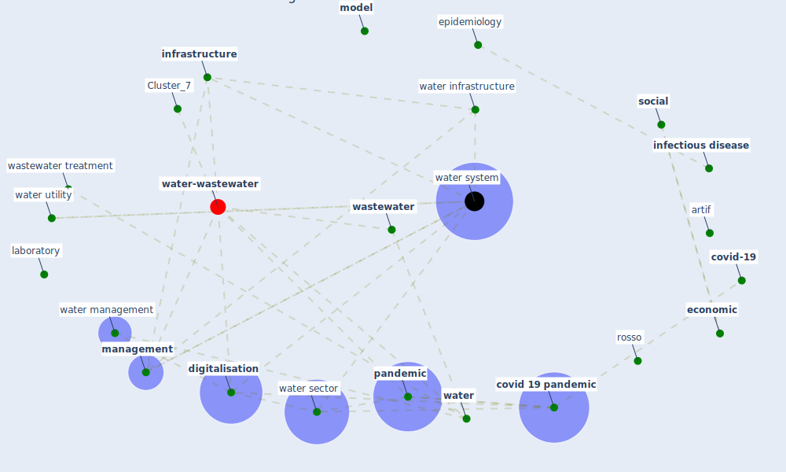

# Article: When the fourth water and digital revolution encountered COVID-19 (poch_when_2020)

* Source: [10.1016/j.scitotenv.2020.140980](https://doi.org/10.1016/j.scitotenv.2020.140980)
* Year: 2020
* Cluster: [water-wastewater](cluster_7)

## Keywords

 * I ii, artif, [barcelona](keyword_barcelona), bottled water, [california](keyword_california), chemical, [climate change](keyword_climate_change), complexity science, [coronavirus](keyword_coronavirus), covid 19 outbreak, [covid 19 pandemic](keyword_covid_19_pandemic), [covid-19](keyword_covid-19), [datum](keyword_datum), datum analysis, decision make, develop, develop country, [digitalisation](keyword_digitalisation), disinfection by product, ecology, [economic](keyword_economic), effluent, [epidemic](keyword_epidemic), [epidemiology](keyword_epidemiology), [europe](keyword_europe), fourth revolution, [france](keyword_france), [genome](keyword_genome), genre, [health](keyword_health), hydrology, hygiene, [impact](keyword_impact), [industry](keyword_industry), [infectious disease](keyword_infectious_disease), [infrastructure](keyword_infrastructure), laboratory, [lockdown](keyword_lockdown), maday, [management](keyword_management), [model](keyword_model), noriega, palma madrid, [pandemic](keyword_pandemic), [plan](keyword_plan), poch, policy maker, policy making, popartan, [process](keyword_process), protective mask, [public](keyword_public), [public health](keyword_public_health), public policy, public water, publico, público, quality of service, [resilience](keyword_resilience), rosso, s g r a p h, sanitary, science, science fiction, [sensor](keyword_sensor), [sewage](keyword_sewage), [sewer](keyword_sewer), shortage, smart meter, [social](keyword_social), [spain](keyword_spain), [surveillance](keyword_surveillance), tap water, technol sci, [treatment](keyword_treatment), university of california, [urban](keyword_urban), urban water cycle, [utility](keyword_utility), value judgment, vanrolleghem, villez, [virus](keyword_virus), wasserbetriebe, [wastewater](keyword_wastewater), wastewater treatment, wastewater treatment plant, [water](keyword_water), water cycle, water disinfection, water engineering, water infrastructure, water management, water sector, water supply, water system, water treatment, water utility, water utility management, flow

## Concepts

 

## Neighbours

### Closest articles

* Future perspectives of wastewater-based epidemiology: Monitoring infectious disease spread and resistance to the community level - [LINK](article_sims_future_2020)
* An environmental and health perspective for COVID-19 outbreak: Meteorology and air quality influence, sewage epidemiology indicator, hospitals disinfection, drug therapies and recommendations - [LINK](article_barcelo_environmental_2020)
* Computational analysis of SARS-CoV-2/COVID-19 surveillance by wastewater-based epidemiology locally and globally: Feasibility, economy, opportunities and challenges - [LINK](article_hart_computational_2020)
* Wastewater surveillance for population-wide Covid-19: The present and future - [LINK](article_daughton_wastewater_2020)
* Disinfection technology of hospital wastes and wastewater: Suggestions for disinfection strategy during coronavirus Disease 2019 (COVID-19) pandemic in China - [LINK](article_wang_disinfection_2020)
* SARS-CoV-2 in wastewater: potential health risk, but also data source - [LINK](article_lodder_sars-cov-2_2020)
* Wastewater-Based Epidemiology to monitor COVID-19 outbreak: Present and future diagnostic methods to be in your radar - [LINK](article_barcelo_wastewater-based_2020)
* Presence of SARS-Coronavirus-2 RNA in Sewage and Correlation with Reported COVID-19 Prevalence in the Early Stage of the Epidemic in The Netherlands - [LINK](article_medema_presence_2020)
* SARS-CoV-2 RNA in wastewater anticipated COVID-19 occurrence in a low prevalence area - [LINK](article_randazzo_sars-cov-2_2020)
* First detection of SARS-CoV-2 in untreated wastewaters in Italy - [LINK](article_la_rosa_first_2020)

### Closest BPs

* Blueprint: Monitoring of wastewater - [LINK](bp_21)
* Blueprint: Installing UV in ductwork - [LINK](bp_10)
* Blueprint: Smart Locker System - [LINK](bp_1)
