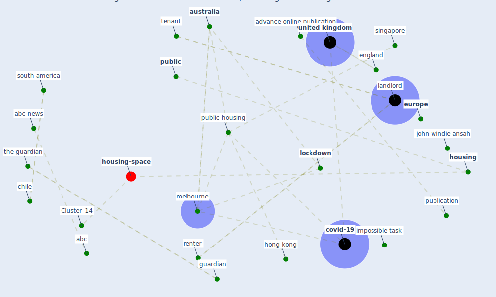

# Article: Public housing and COVID-19: contestation, challenge and change (power_public_2020)

* Source: [10.1080/19491247.2020.1797991](https://doi.org/10.1080/19491247.2020.1797991)
* Year: 2020
* Cluster: [space-housing](cluster_4)

## Keywords

 * abc, abc news, adu gyamfi, advance online, advance online publication, albert adu gyamfiet, asia, atakora, [australia](keyword_australia), be at home, behaviour, byrne m, carnegie a, chile, continent, [coronavirus](keyword_coronavirus), coronavirus victoria, [country](keyword_country), [covid 19 pandemic](keyword_covid_19_pandemic), [covid-19](keyword_covid-19), czech republic, dublin, dutch, empirical, england, [europe](keyword_europe), geography, ghana, guardian, gyamfiet, hazel easthope, [hong kong](keyword_hong_kong), [housing](keyword_housing), housing allocation, housing base welfare, housing law and policy, housing option for old people in a reimagine housing system, impossible task, ipv6, ipv7, ireland, issue 2, john windie ansah, kumasi, [landlord](keyword_landlord), literaturemappe, [lockdown](keyword_lockdown), martin lux, martina mikeszov a, martina mikeszova, [melbourne](keyword_melbourne), melbourne tower, methodological, multi dimensional, neoliberalism, new public housing, newspaper, nsw government, paris, penrith nsw, poku boansi, poku boansi m, police, [policy](keyword_policy), policy review, progress in human geography, [public](keyword_public), [public housing](keyword_public_housing), public housing policy, public housing tower, publication, rent, rental, renter, research evidence, reversemortgage, richard ronald, roger power, rubyprincess debacle, serin b, singapore, soaita a, [social](keyword_social), south america, subsidy, support for resident, [sustainable development goal](keyword_sustainable_development_goal), [switzerland](keyword_switzerland), [sydney](keyword_sydney), systematic, takyiakwaa, tenant, the guardian, the netherlands, the politic and practice of apartment live, tomoko kubo, [united kingdom](keyword_united_kingdom), vergara l, western sydney university, yoshimichi yui

## Concepts

 

## Neighbours

### Closest articles

* Dangerous liaisons? Applying the social harm perspective to the social inequality, housing and health trifecta during the Covid-19 pandemic - [LINK](article_gurney_dangerous_2021)
* Eviction, Health Inequity, and the Spread of COVID-19: Housing Policy as a Primary Pandemic Mitigation Strategy - [LINK](article_benfer_eviction_2021)
* Housing Experience in Gated Communities in the Time of Pandemics: Lessons Learned from COVID-19 - [LINK](article_asfour_housing_2022)
* Urban Community Sustainable Development Patterns under the Influence of COVID-19: A Case Study Based on the Non-Contact Interaction Perspective of Hangzhou City - [LINK](article_wang_urban_2021)
* The City Under COVID‐19: Podcasting As Digital Methodology - [LINK](article_rogers_city_2020)
* A Mixed Approach on Resilience of Spanish Dwellings and Households during COVID-19 Lockdown - [LINK](article_cuerdo-vilches_mixed_2020)
* Association between indoor-outdoor green features and psychological health during the COVID-19 lockdown in Italy: A cross-sectional nationwide study - [LINK](article_spano_association_2021)
* Questioning the use of the balcony in apartments during the COVID-19 pandemic process - [LINK](article_aydin_questioning_2020)
* Understanding the role of urban design in disease spreading - [LINK](article_brizuela_understanding_2019)

### Closest BPs

* Blueprint: Resilience in staffing and skills training - [LINK](bp_12)
* Blueprint: Monitoring of wastewater - [LINK](bp_21)
* Blueprint: Installing high-efficiency air filters - [LINK](bp_11)
