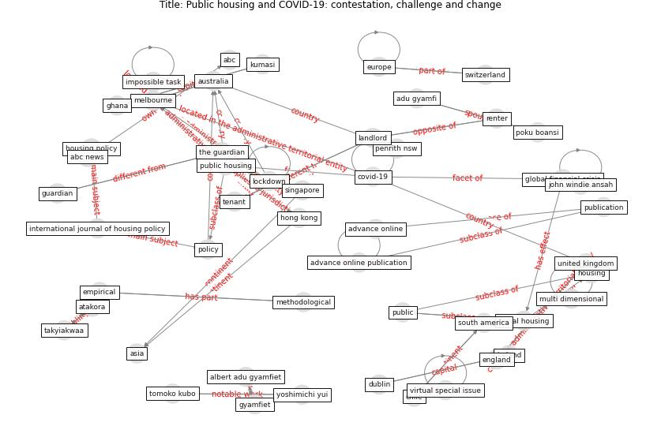

# Article: Public housing and COVID-19: contestation, challenge and change (power_public_2020)

* Source: [10.1080/19491247.2020.1797991](https://doi.org/10.1080/19491247.2020.1797991)
* Year: 2020
* Cluster: [building-space](cluster_9)

## Keywords

 * abc, abc news, adu gyamfi, advance online, advance online publication, age in place, albert adu gyamfiet, asia, atakora, [australia](keyword_australia), australian chief medical officer, chile, continent, [coronavirus](keyword_coronavirus), coronavirus victoria, [country](keyword_country), [covid 19 pandemic](keyword_covid_19_pandemic), [covid-19](keyword_covid-19), czech republic, decommodifie housing, dublin, dutch, empirical, england, [europe](keyword_europe), ghana, global financial crisis, guardian, gyamfiet, hazel easthope, [hong kong](keyword_hong_kong), [housing](keyword_housing), housing base welfare, housing law and policy, housing option for old people in a reimagine housing system, housing policy, housing system, impossible task, insider and outsider in french social housing allocation, international journal of housing policy, ipv6, ipv7, ireland, john windie ansah, kumasi, [landlord](keyword_landlord), local government, local hospital, [lockdown](keyword_lockdown), martin lux, martina mikeszov a, martina mikeszova, [melbourne](keyword_melbourne), melbourne tower, methodological, multi dimensional, new public housing, newspaper, nsw government, paul kelly, penrith nsw, peter boelhouwer, poku boansi, [policy](keyword_policy), policy review, progress in human geography, [public](keyword_public), [public housing](keyword_public_housing), publication, renter, residential care, reversemortgage, rubyprincess debacle, sector, serin b, [singapore](keyword_singapore), soaita a, [social](keyword_social), [social housing](keyword_social_housing), south america, spatial disrepute, [switzerland](keyword_switzerland), takyiakwaa, tenant, territory and territorial stigmatisation, the guardian, the local hospital, the netherlands, the politic and practice of apartment live, the role of third sector organisation in the management of social condominium in chile, tomoko kubo, transformation, [united kingdom](keyword_united_kingdom), van der flier k, vergara l, victoria, virtual special issue, western sydney university, woodberry down, yoshimichi yui

## Concepts

 

## Neighbours

### Closest articles

* Dangerous liaisons? Applying the social harm perspective to the social inequality, housing and health trifecta during the Covid-19 pandemic - [LINK](article_gurney_dangerous_2021)
* Eviction, Health Inequity, and the Spread of COVID-19: Housing Policy as a Primary Pandemic Mitigation Strategy - [LINK](article_benfer_eviction_2021)
* Housing Experience in Gated Communities in the Time of Pandemics: Lessons Learned from COVID-19 - [LINK](article_asfour_housing_2022)
* How our homes impact our health: using a COVID-19 informed approach to examine urban apartment housing - [LINK](article_peters_how_2020)
* Towards Resilient Residential Buildings and Neighborhoods in Light of COVID-19 Pandemic—The Scenario of Podgorica, Montenegro - [LINK](article_bojovic_towards_2022)
* Questioning the use of the balcony in apartments during the COVID-19 pandemic process - [LINK](article_aydin_questioning_2020)
* Health, Economic and Social Development Challenges of the COVID-19 Pandemic: Strategies for Multiple and Interconnected Issues - [LINK](article_panneer_health_2022)
* COVID-19 and Green Housing: A Review of Relevant Literature - [LINK](article_kaklauskas_covid-19_2021)
* A Mixed Approach on Resilience of Spanish Dwellings and Households during COVID-19 Lockdown - [LINK](article_cuerdo-vilches_mixed_2020)
* The socio-economic implications of the coronavirus pandemic (COVID-19): A review - [LINK](article_nicola_socio-economic_2020)

### Closest BPs

* Blueprint: Air Cleaning Plants - [LINK](bp_15)
* Blueprint: Architecture design - [LINK](bp_2)
* Blueprint: Tender support at building stage - [LINK](bp_9)
