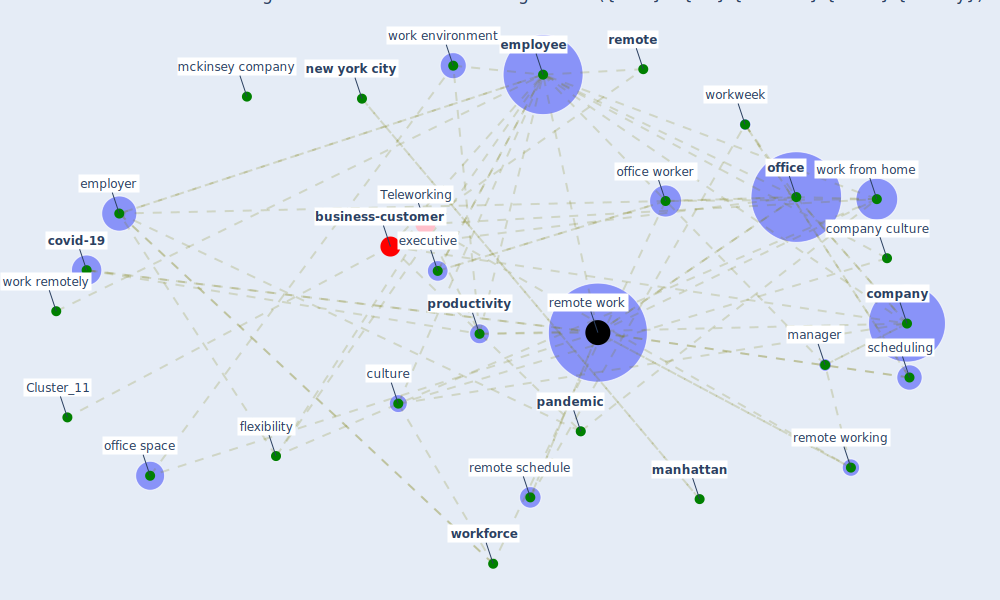

# Article: It’s time to reimagine where and how work will get done (PwC’s US Remote Work Survey) (pricewaterhousecoopers_its_2021)

* [https://www.pwc.com/us/en/services/consulting/business-transformation/library/covid-19-us-remote-work-survey.html](https://www.pwc.com/us/en/services/consulting/business-transformation/library/covid-19-us-remote-work-survey.html)
* Year: 2021
* Cluster: [business-customer](cluster_11)

## Keywords

 * 7 11 option, add up, add up to 100, age, [anxiety](keyword_anxiety), [austin](keyword_austin), benefit, business performance, coach, collaboration, [company](keyword_company), company culture, [consent](keyword_consent), consumer product, [covid-19](keyword_covid-19), cubicle, culture, day a week, [employee](keyword_employee), employee engagement, [employer](keyword_employer), executive, executive director, female, flexibility, four day per week, gender, go with the flow, goal, health check, [home](keyword_home), hybrid, hybrid working model, hybrid workplace, important, in person, job description, location, male, manage, [manager](keyword_manager), [manhattan](keyword_manhattan), mckinsey company, meeting place, microsoft window, [new jersey](keyword_new_jersey), [new york](keyword_new_york), [new york city](keyword_new_york_city), new york stock exchange, new york yankees, [office](keyword_office), office space, office worker, office workweek, onboarde, open floor plan, operate system, [pandemic](keyword_pandemic), [people](keyword_people), [policy](keyword_policy), precovid, premier business district, privacy shield, productive, [productivity](keyword_productivity), [relationship](keyword_relationship), [remote](keyword_remote), remote schedule, [remote work](keyword_remote_work), remote work productivity, remote working, retail, return to work, revenue, rollout, round, safety expectation, schedule, scheduling, scheduling tool, set, stock exchange, [stress](keyword_stress), success, template, [texas](keyword_texas), three day per week, [total](keyword_total), [training](keyword_training), two day per week, [vaccination](keyword_vaccination), [vaccine](keyword_vaccine), [work](keyword_work), work environment, work from home, work remotely, [workforce](keyword_workforce), [workplace](keyword_workplace), workplace design, workweek

## Concepts

 

## Neighbours

### Closest articles

* A study on office workplace modification during the COVID-19 pandemic in The Netherlands - [LINK](article_hou_study_2021)
* COVID-19 Experience Transforming the Protective Environment of Office Buildings and Spaces - [LINK](article_phapant_covid-19_2021)
* Sustainable work throughout the life course: National policies and strategies, Publications Office of the European Union - [LINK](article_eurofund_sustainable_2016)
* Will a pandemic change building codes? - [LINK](article_rozgus_will_2020)
* How will COVID-19 change future building regulations? - [LINK](article_hmc_architects_how_2020)
* The effect of a redesigned floor plan, occupant density and the quality of indoor climate on the cost of space, productivity and sick leave in an office building–A case study - [LINK](article_saari_effect_2006)
* Health, Wellbeing \& Productivity in Offices - [LINK](article_world_green_building_council_health_2014)
* The COVID-19 Impact on Flexible Office Space - [LINK](article_clifton_covid-19_2020)
* Assessment of COVID-19 precautionary measures in sports facilities: A case study on a health club in Saudi Arabia - [LINK](article_ibrahim_assessment_2022)
* Compliance with COVID-19 Mitigation Measures in the United States - [LINK](article_van_rooij_compliance_2020)

### Closest BPs

* Blueprint: Air Cleaning Plants - [LINK](bp_15)
* Blueprint: Installing high-efficiency air filters - [LINK](bp_11)
* Blueprint: Indoor Environmental Quality (IEQ) monitoring system - [LINK](bp_3)
