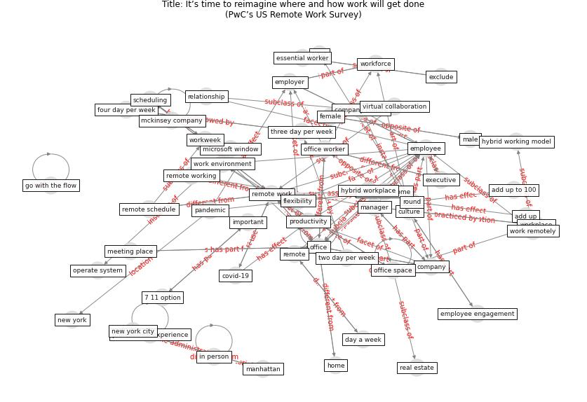

# Article: It’s time to reimagine where and how work will get done(PwC’s US Remote Work Survey) (pricewaterhousecoopers_its_2021)

* [https://www.pwc.com/us/en/services/consulting/business-transformation/library/covid-19-us-remote-work-survey.html](https://www.pwc.com/us/en/services/consulting/business-transformation/library/covid-19-us-remote-work-survey.html)
* Year: 2021
* Cluster: [building-space](cluster_1)

## Keywords

 * 7 11 option, add up, add up to 100, age, [anxiety](keyword_anxiety), [austin](keyword_austin), benefit, business performance, coach, collaboration, [company](keyword_company), company culture, [consent](keyword_consent), consumer product, [covid-19](keyword_covid-19), creativity, cubicle, culture, day a week, [employee](keyword_employee), employee engagement, [employer](keyword_employer), essential worker, exclude, executive, executive director, female, firm, flexibility, four day per week, gender, go with the flow, [goal](keyword_goal), health check, [home](keyword_home), hybrid, hybrid working model, hybrid workplace, important, in person, job description, legal entity, location, male, manage, [manager](keyword_manager), [manhattan](keyword_manhattan), mckinsey company, meeting place, microsoft window, [new york](keyword_new_york), [new york city](keyword_new_york_city), new york stock exchange, new york yankees, [office](keyword_office), office space, office worker, onboarde, open floor plan, operate system, [pandemic](keyword_pandemic), physical office, premier business district, productive, [productivity](keyword_productivity), professional experience, real estate, relationship, remote, remote schedule, [remote work](keyword_remote_work), remote working, retail, return to work, revenue, rollout, round, scheduling, scheduling tool, set, stock exchange, [stress](keyword_stress), success, template, [texas](keyword_texas), three day per week, total, [training](keyword_training), two day per week, vaccination, [vaccine](keyword_vaccine), virtual collaboration, [work](keyword_work), work environment, work from home, work remotely, workforce, [workplace](keyword_workplace), workplace design, workweek

## Concepts

 

## Neighbours

### Closest articles

* A study on office workplace modification during the COVID-19 pandemic in The Netherlands - [LINK](article_hou_study_2021)
* COVID-19 Experience Transforming the Protective Environment of Office Buildings and Spaces - [LINK](article_phapant_covid-19_2021)
* The COVID-19 Impact on Flexible Office Space - [LINK](article_clifton_covid-19_2020)
* Health, Wellbeing \& Productivity in Offices - [LINK](article_world_green_building_council_health_2014)
* Architectural Design Drives the Biogeography of Indoor Bacterial Communities - [LINK](article_kembel_architectural_2014)
* How will COVID-19 change future building regulations? - [LINK](article_hmc_architects_how_2020)
* Occupant health in buildings: Impact of the COVID-19 pandemic on the opinions of building professionals and implications on research - [LINK](article_awada_occupant_2022)
* Will a pandemic change building codes? - [LINK](article_rozgus_will_2020)
* Ten questions concerning occupant health in buildings during normal operations and extreme events including the COVID-19 pandemic - [LINK](article_awada_ten_2021)
* The effect of a redesigned floor plan, occupant density and the quality of indoor climate on the cost of space, productivity and sick leave in an office building–A case study - [LINK](article_saari_effect_2006)

### Closest BPs

* Blueprint: Building Adaptation during a pandemic - [LINK](bp_14)
* Blueprint: Architecture design - [LINK](bp_2)
* Blueprint: Tender support at building stage - [LINK](bp_9)
