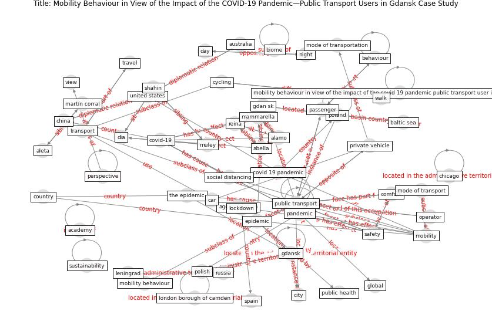

# Article: Mobility Behaviour in View of the Impact of the COVID-19 Pandemic—Public Transport Users in Gdansk Case Study (przybylowski_mobility_2021)

* Source: [10.3390/su13010364](https://doi.org/10.3390/su13010364)
* Year: 2021
* Cluster: [city-health](cluster_14)

## Keywords

 * abella, [academy](keyword_academy), agglomeration, alamo, aleta, [attitude](keyword_attitude), [australia](keyword_australia), baltic sea, barbieri, basel, before the pandemic, behaviour, bike sharing, biome, car, chicago, [china](keyword_china), [city](keyword_city), comfort, [control](keyword_control), [country](keyword_country), [covid 19 pandemic](keyword_covid_19_pandemic), [covid-19](keyword_covid-19), cycling, day, dia, [digital technology](keyword_digital_technology), drive skill, driver, dutch, earthquake, [economic](keyword_economic), english language, [epidemic](keyword_epidemic), feeling of comfort, gdan sk, gdansk, [global](keyword_global), [india](keyword_india), [japan](keyword_japan), lampos, leningrad, less regularly, lisbon, [lockdown](keyword_lockdown), london borough of camden, mammarella, martín corral, [milan](keyword_milan), [mobility](keyword_mobility), mobility behaviour, mobility behaviour in view of the impact of the covid 19 pandemic public transport user in gdansk case study, mobility choice, mode of transport, mode of transportation, muley, nat nat, [netherland](keyword_netherland), nian, night, not applicable, [office](keyword_office), operator, [pandemic](keyword_pandemic), paris, passenger, [perspective](keyword_perspective), [poland](keyword_poland), polish, private mobility, private vehicle, [public health](keyword_public_health), [public transport](keyword_public_transport), reina, russia, [safety](keyword_safety), [school](keyword_school), second wave, shahin, share mobility, sierpin ski, [social](keyword_social), [social distancing](keyword_social_distancing), [spain](keyword_spain), staniek, studzieniecki, [sustainability](keyword_sustainability), [switzerland](keyword_switzerland), the epidemic, [transport](keyword_transport), transport behaviour, transport decision, [travel](keyword_travel), [united kingdom](keyword_united_kingdom), [united states](keyword_united_states), [urban](keyword_urban), urban mobility, view, walk, zhuang

## Concepts

 

## Neighbours

### Closest articles

* Responsible Transport: A post-COVID agenda for transport policy and practice - [LINK](article_budd_responsible_2020)
* Urban planning after COVID-19 - [LINK](article_rtpi_urban_2021)
* Proximity and post-COVID-19 urban development: Reflections from Milan, Italy - [LINK](article_tricarico_proximity_2021)
* The Smart City and Covid‐19 - [LINK](article_webb_smart_2020)
* The three modes of existence of the pandemic smart city - [LINK](article_soderstrom_three_2021)
* Global policy challenges for urban vector-borne disease risks - [LINK](article_alabaster_global_2016)
* The Emergence of Anti-Privacy and Control at the Nexus between the Concepts of Safe City and Smart City - [LINK](article_allam_emergence_2019)
* On the Coronavirus (COVID-19) Outbreak and the Smart City Network: Universal Data Sharing Standards Coupled with Artificial Intelligence (AI) to Benefit Urban Health Monitoring and Management - [LINK](article_allam_coronavirus_2020)
* Smart cities and the pandemic: digital technologies on the urban management of Brazilian cities - [LINK](article_fariniuk_smart_2020)

### Closest BPs

* Blueprint: Architecture design - [LINK](bp_2)
* Blueprint: Building Adaptation during a pandemic - [LINK](bp_14)
* Blueprint: Tender support at building stage - [LINK](bp_9)
