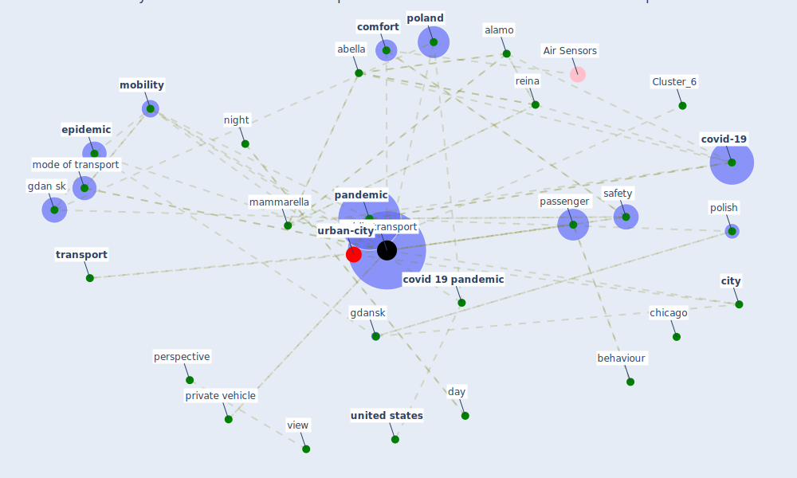

# Article: Mobility Behaviour in View of the Impact of the COVID-19 Pandemic—Public Transport Users in Gdansk Case Study (przybylowski_mobility_2021)

* Source: [10.3390/su13010364](https://doi.org/10.3390/su13010364)
* Year: 2021
* Cluster: [urban-city](cluster_6)

## Keywords

 * abella, [academy](keyword_academy), agglomeration, ahangari, alamo, aleta, [attitude](keyword_attitude), [australia](keyword_australia), authority, baltic sea, barbieri, basel, before the pandemic, behaviour, bike sharing, biome, car, chicago, [china](keyword_china), [city](keyword_city), [comfort](keyword_comfort), [control](keyword_control), [country](keyword_country), [covid 19 pandemic](keyword_covid_19_pandemic), [covid-19](keyword_covid-19), crossref beck, [cycling](keyword_cycling), day, dia, [epidemic](keyword_epidemic), feeling of comfort, forecast, fossa, gdan sk, gdansk, gdynia, global, [health and safety](keyword_health_and_safety), [india](keyword_india), informed consent statement, [italy](keyword_italy), [japan](keyword_japan), lampos, leningrad, less regularly, [lockdown](keyword_lockdown), london borough of camden, mammarella, martín corral, [milan](keyword_milan), [mobility](keyword_mobility), mobility behaviour, mobility behaviour in view of the impact of the covid 19 pandemic public transport user in gdansk case study, mode of transport, mode of transportation, muley, night, [office](keyword_office), operator, [pandemic](keyword_pandemic), paris, passenger, [perspective](keyword_perspective), piontti, [poland](keyword_poland), polish, pre-pandemic, private mobility, private vehicle, [public health](keyword_public_health), [public transport](keyword_public_transport), reina, renukappa, [russia](keyword_russia), [safety](keyword_safety), santamaria, santander, [school](keyword_school), second wave, shahin, share mobility, sierpin ski, [social](keyword_social), socioeconomic, [spain](keyword_spain), staniek, studzieniecki, [sustainability](keyword_sustainability), [switzerland](keyword_switzerland), the epidemic, [transport](keyword_transport), transport behaviour, transport decision, [travel](keyword_travel), [united kingdom](keyword_united_kingdom), [united states](keyword_united_states), urban mobility, view, walk, zhuang

## Concepts

 

## Neighbours

### Closest articles

* Responsible Transport: A post-COVID agenda for transport policy and practice - [LINK](article_budd_responsible_2020)
* Should I Stay or Should I Go? Tourists’ COVID-19 Risk Perception and Vacation Behavior Shift - [LINK](article_bratic_should_2021)
* Seeing the invisible hand: Underlying effects of COVID-19 on tourists’ behavioral patterns - [LINK](article_li_seeing_2020)
* Touchless Retail: What the Rest of the World could learn from China’s new ways to shop - [LINK](article_capgemini_touchless_2020)
* What our response to the COVID-19 pandemic tells us of our capacity to respond to climate change - [LINK](article_gemenne_what_2020)
* Coronavirus and Climate Change - [LINK](article_harvard_th_chan_schoold_of_public_health_coronavirus_2020)
* COVID-19 risks and systemic gaps in Nigeria: resilience building lessons for pandemic and climate change management - [LINK](article_lawal_covid-19_2022)
* Retail Signage During the COVID-19 Pandemic - [LINK](article_mcneish_retail_2020)
*  - [LINK](article_yakubu_aminu_dodo_green_2020)

### Closest BPs

* Blueprint: Smart Locker System - [LINK](bp_1)
* Blueprint: Mental health – Belong: Do something with someone - [LINK](bp_19)
* Blueprint: Mental health – Act: Do something - [LINK](bp_18)
