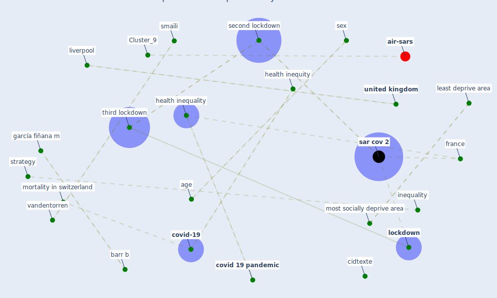

# Article: COVID-19 and social inequalities: a complex and dynamic interaction (quantin_covid-19_2022)

* Source: [10.1016/S2468-2667(22)00033-0](https://doi.org/10.1016/S2468-2667(22)00033-0)
* Year: 2022
* Cluster: [air-sars](cluster_9)

## Keywords

 * 10 1016 s2468 2667 21 00007 x, age, althaus cl, barr b, cc by nc nd 4 0 license, census, chatignoux, chu dijon, chu dijon bourgogne, cidtexte, community health, covid 19 care cascade, [covid 19 pandemic](keyword_covid_19_pandemic), covid 19 testing, covid 19 vaccine, [covid-19](keyword_covid-19), database, declaration of independence, declare, declare no compete interest, densely populate, densely populate area, densely populated area, densely populated municipality, deprive area, dree, dree solidarite sante, dépémie de covid 19, ecological, epidemiol, european deprivation index, [france](keyword_france), french, french government, friedrichs m, garcía fiñana, garcía fiñana m, [health](keyword_health), health crisis, health inequality, health inequity, inequality, [interaction](keyword_interaction), [inégalités sociale face à l épidémie de covid 19](keyword_inégalités_sociale_face_à_l_épidémie_de_covid_19), lancet public health, least deprive area, lewis nm, liverpool, liverpool uk, [lockdown](keyword_lockdown), major health crisis, [malaria](keyword_malaria), morb, mortal, mortality in switzerland, most deprive area, most socially deprive area, no compete interest, open access, panczak, panczak r, [pandemic](keyword_pandemic), [perspective](keyword_perspective), [public health](keyword_public_health), public health law, [quality](keyword_quality), s2468 2667 21 00007 x, [sar cov 2](keyword_sar_cov_2), sar cov 2 infection, sar cov 2 pandemic, sar cov 2 pandemic in france, [second lockdown](keyword_second_lockdown), sex, significant, small, smaïli, socially deprive, socioeconomic, socioeconomic variable, solidarite sante, sparsely populate area, sparsely populated area, spatiotemporal, statistically, statistically significant, strategy, système d information de dépistage populationnel, testing, the exclude area, the third lockdown, third lockdown, uah, [unesco](keyword_unesco), [united kingdom](keyword_united_kingdom), [united states](keyword_united_states), vaccination, vaccination uptake, vandentorren, [world heritage site](keyword_world_heritage_site), état des lieux et perspective

## Concepts

 

## Neighbours

### Closest articles

* Mental health economics: A prospective study on psychological flourishing and associations with healthcare costs and sickness benefit transfers in Denmark - [LINK](article_santini_mental_2021)
* The impact of COVID-19 and strategies for mitigation and suppression in low- and middle-income countries - [LINK](article_walker_impact_2020)
* Multilevel Analysis of Personal, Non-Medical COVID-19-Related Impact Worldwide - [LINK](article_dye_multilevel_2020)
* Response to COVID-19 in Taiwan - [LINK](article_wang_response_2020)
* COVID-19 and the rise of intimate partner violence - [LINK](article_aguero_covid-19_2021)
* The Socio-Spatial Determinants of COVID-19 Diffusion: The Impact of Globalisation, Settlement Characteristics and Population - [LINK](article_sigler_socio-spatial_2020)
* What has been the impact of the COVID-19 pandemic on immigrants? An update on recent evidence - [LINK](article_oecd_what_2022)
* Covid-19 and community mitigation strategies in a pandemic - [LINK](article_ebrahim_covid-19_2020)
* Coronavirus disease 2019: The harms of exaggerated information and non‐evidence‐based measures - [LINK](article_ioannidis_coronavirus_2020)

### Closest BPs

* Blueprint: Resilience in staffing and skills training - [LINK](bp_12)
* Blueprint: Tracking and enforcing use of Personal Protective Equipment - [LINK](bp_23)
* Blueprint: Air Cleaning Plants - [LINK](bp_15)
