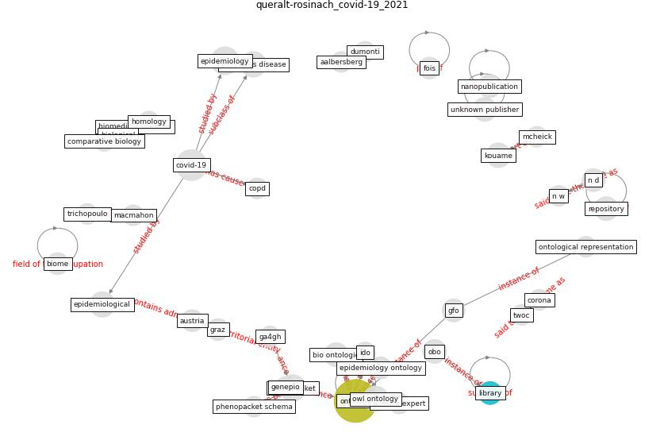

# Article: __The COVID-19 epidemiology and monitoring ontology__ (queralt-rosinach_covid-19_2021)

* [10.37044/osf.io/n6tcz](https://doi.org/10.37044/osf.io/n6tcz)
* Cluster: [ontology-datum](cluster_12)

## Keywords

[ontology](keyword_ontology), [library](keyword_library)

## Abstract

The novel COVID-19 infectious disease emerged and spread,
causing high mortality and morbidity rates worldwide. In
the OBO Foundry, there are more than one hundred ontologies
to share and analyse large-scale datasets for biological
and biomedical sciences. However, this pandemic revealed
that we lack tools for an efficient and timely exchange of
this epidemiological data which is necessary to assess the
impact of disease outbreaks, the efficacy of mitigating
interventions and to provide a rapid response. In this
study we present our findings and contributions for the
bio-ontologies community.

## Concepts

 

