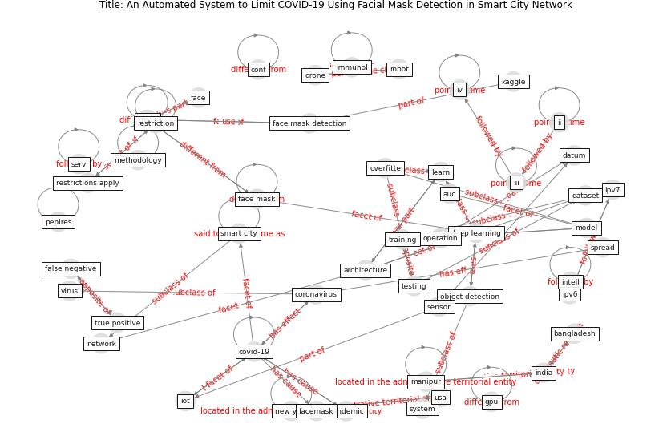

# Article: An Automated System to Limit COVID-19 Using Facial Mask Detection in Smart City Network (rahman_automated_2020)

* Source: [10.1109/IEMTRONICS51293.2020.9216386](https://doi.org/10.1109/IEMTRONICS51293.2020.9216386)
* Year: 2020
* Cluster: [city-health](cluster_14)

## Keywords

 * 04samples, 64 64 shape, [architecture](keyword_architecture), auc, [australia](keyword_australia), bangladesh, block, cctv, cern, [china](keyword_china), city network, conf, confidence of prediction, [coronavirus](keyword_coronavirus), [covid-19](keyword_covid-19), [dataset](keyword_dataset), [datum](keyword_datum), [deep learning](keyword_deep_learning), dense network, detect, device, die, [drone](keyword_drone), eye, face, [face mask](keyword_face_mask), face mask detection, facemask, facial, false negative, flatten layer, framework, gpu, grayscale, healthmap, hidden layer, ii, iii, image, immunol, [india](keyword_india), input layer, intell, [iot](keyword_iot), ipv6, ipv7, iv, kaggle, khulna university of engineering, layer, learn, learn algorithm, liu, [manipur](keyword_manipur), maryland, [mask](keyword_mask), mask class, methodology, mjolnir, [model](keyword_model), [network](keyword_network), [new south wale](keyword_new_south_wale), [new york](keyword_new_york), normalization, norway, nose, [object detection](keyword_object_detection), [operation](keyword_operation), overfitte, [pandemic](keyword_pandemic), [pep](keyword_pep), pepires, receiver operating characteristic, [restriction](keyword_restriction), restrictions apply, rgb color image, [robot](keyword_robot), roc curve, section v, section vi, [sensor](keyword_sensor), serv, [smart city](keyword_smart_city), [spread](keyword_spread), [symptom](keyword_symptom), [system](keyword_system), take action, test accuracy, [testing](keyword_testing), testing loss, testing phase, trained model, [training](keyword_training), training phase, true positive, [usa](keyword_usa), utility, [virus](keyword_virus), without mask, ḯ 1

## Concepts

 

## Neighbours

### Closest articles

* Towards the sustainable development of smart cities through mass video surveillance: A response to the COVID-19 pandemic - [LINK](article_shorfuzzaman_towards_2021)
*  - [LINK](article_huy-tran_design_2022)
* DeepSOCIAL: Social Distancing Monitoring and Infection Risk Assessment in COVID-19 Pandemic - [LINK](article_rezaei_deepsocial_2020)
* COVID-19 Higher Mortality in Chinese Regions With Chronic Exposure to Lower Air Quality - [LINK](article_pansini_covid-19_2021)
* Air pollution linked with higher COVID-19 death rates - [LINK](article_harvard_th_chan_schoold_of_public_health_air_2020)
* Nurture to nature via COVID-19, a self-regenerating environmental strategy of environment in global context - [LINK](article_paital_nurture_2020)
* Indirect effects of COVID-19 on the environment - [LINK](article_zambrano-monserrate_indirect_2020)
* COVID-19 Forced Hospitals to Build Negative Pressure Rooms Fast - [LINK](article_dyer_covid-19_2020)
* Disinfection technology of hospital wastes and wastewater: Suggestions for disinfection strategy during coronavirus Disease 2019 (COVID-19) pandemic in China - [LINK](article_wang_disinfection_2020)
* When the fourth water and digital revolution encountered COVID-19 - [LINK](article_poch_when_2020)

### Closest BPs

* Blueprint: Negative pressure rooms - [LINK](bp_13)
* Blueprint: Monitoring of wastewater [CID] - [LINK](bp_21)
* Blueprint: Installing UV in ductwork - [LINK](bp_10)
