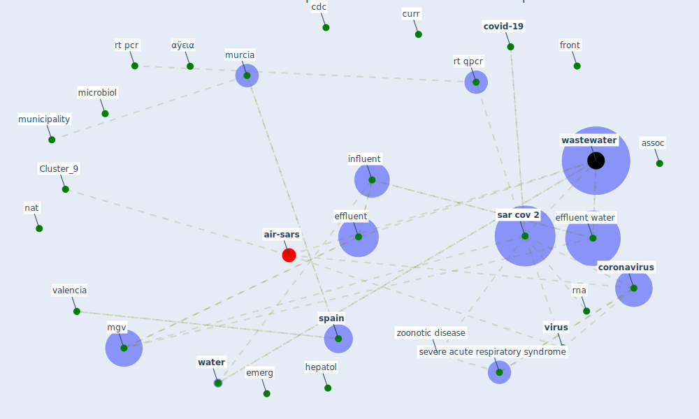

# Article: SARS-CoV-2 RNA in wastewater anticipated COVID-19 occurrence in a low prevalence area (randazzo_sars-cov-2_2020)

* Source: [10.1016/j.watres.2020.115942](https://doi.org/10.1016/j.watres.2020.115942)
* Year: 2020
* Cluster: [wastewater-water](cluster_0)

## Keywords

 * 5 335e337, SARS-CoV-2, assoc, belgium, biobanke, buffer iii, cartagena, [cdc](keyword_cdc), cebas csic, centrifuge, [clinical](keyword_clinical), compete, [conflict of interest](keyword_conflict_of_interest), coronaviridae, [coronavirus](keyword_coronavirus), coronavirus lockdown, [covid-19](keyword_covid-19), csic, curr, document, effluent, effluent water, effluent waters, emerg, [epidemiological](keyword_epidemiological), [epidemiology](keyword_epidemiology), esamur, [france](keyword_france), front, gastroenterol, [germany](keyword_germany), hepatol, [hepatology](keyword_hepatology), hygiene, iberian peninsula, [infect](keyword_infect), [influent](keyword_influent), influent water, iso 15216e1, lfel, marechal, [method](keyword_method), mgv, microb, microbe, [microbiol](keyword_microbiol), [microorganism](keyword_microorganism), molecular, monitoring of illicit drug consumption, mouchel, moulin, municipality, murcia, murcia region, müller, n3, nat, noroviru, opin, paris, [pathogen](keyword_pathogen), pedv, [primer](keyword_primer), quality assurance, quantification, quantified, reaction mix, region of murcia, risk analysis, river, [rna](keyword_rna), rt pcr, rt qpcr, [russia](keyword_russia), [sanitation](keyword_sanitation), [sar cov 2](keyword_sar_cov_2), seilmaier, semin, severe acute respiratory syndrome, severe acute respiratory syndrome coronavirus 2, [sewage](keyword_sewage), [spain](keyword_spain), taqman, thermo fisher scientific, totana, treat, valencia, [vilnius](keyword_vilnius), [viral](keyword_viral), virological, [virus](keyword_virus), [wastewater](keyword_wastewater), wastewater base epidemiology, [water](keyword_water), who, www document, zoonotic disease, α2, αÿεια, ہیw randazzo

## Concepts

 

## Neighbours

### Closest articles

* Detection of SARS-CoV-2 in raw and treated wastewater in Germany – Suitability for COVID-19 surveillance and potential transmission risks - [LINK](article_westhaus_detection_2021)
* First confirmed detection of SARS-CoV-2 in untreated wastewater in Australia: A proof of concept for the wastewater surveillance of COVID-19 in the community - [LINK](article_ahmed_first_2020)
* Wastewater-Based Epidemiology to monitor COVID-19 outbreak: Present and future diagnostic methods to be in your radar - [LINK](article_barcelo_wastewater-based_2020)
* First detection of SARS-CoV-2 in untreated wastewaters in Italy - [LINK](article_la_rosa_first_2020)
* SARS-CoV-2 Titers in Wastewater Are Higher than Expected from Clinically Confirmed Cases - [LINK](article_wu_sars-cov-2_2020)
* Presence of SARS-Coronavirus-2 RNA in Sewage and Correlation with Reported COVID-19 Prevalence in the Early Stage of the Epidemic in The Netherlands - [LINK](article_medema_presence_2020)
* A Continuously Active Antimicrobial Coating effective against Human Coronavirus 229E - [LINK](article_ikner_continuously_2020)
* Coronavirus and Climate Change - [LINK](article_harvard_th_chan_schoold_of_public_health_coronavirus_2020)
* Refleksioner fra en pandemi - [LINK](article_realdania_refleksioner_2022)

### Closest BPs

* Blueprint: Negative pressure rooms - [LINK](bp_13)
* Blueprint: Smart Locker System - [LINK](bp_1)
* Blueprint: Rotational Shift System - [LINK](bp_0)
