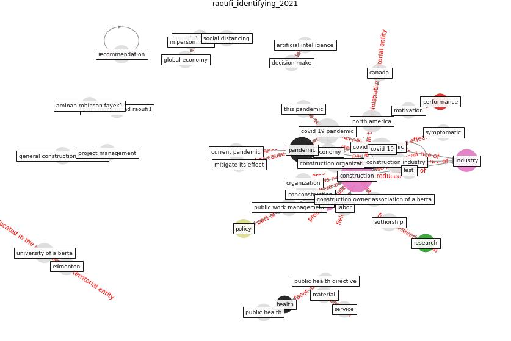

# Article: __Identifying Actions to Control and Mitigate the Effects of the COVID-19 Pandemic on Construction Organizations: Preliminary Findings__ (raoufi_identifying_2021)

* [10.1177/1087724X20969164](https://doi.org/10.1177/1087724X20969164)
* Cluster: [construction-project](cluster_9)

## Keywords

[construction](keyword_construction), [pandemic](keyword_pandemic), [industry](keyword_industry), [policy](keyword_policy), [research](keyword_research)

## Abstract

Construction organizations face many challenges in coping
with the effects of the COVID-19 pandemic on the economy
and the construction work environment. Although each
organization is implementing its own strategies to mitigate
this pandemic’s impact on operations and workers, the
construction industry as a whole urgently needs to identify
the most effective strategies for mitigating the effects of
COVID-19 on its operations in the short term while
preparing response plans and long-term recovery plans. This
article presents preliminary findings of a survey conducted
with construction organizations primarily in North America
to identify and assess mitigation actions taken.
Recommendations based on these findings are provided to
help construction organizations during this pandemic. The
results of this study will help in developing
evidence-based operational strategies to identify new modes
of operating for construction organizations during both the
current pandemic and any future pandemics.

## Concepts

 

