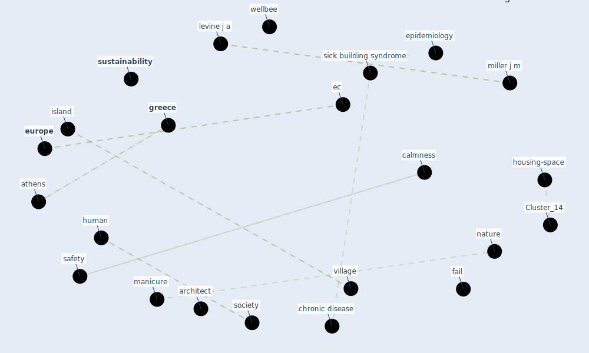

# Article: How Architecture Fails in Conditions of Crisis: a Discussion on the Value of Interior Design over the COVID-19 Outbreak (rassia_how_2020)

* Source: [10.1007/s43069-020-0014-9](https://doi.org/10.1007/s43069-020-0014-9)
* Year: 2020
* Cluster: [building-design](cluster_5)

## Keywords

 * allergy, amphibian, [architect](keyword_architect), [architecture](keyword_architecture), athens, be this truly the case, build syndrome, building design, calmness, cantilever, catalog, chateau, [china](keyword_china), [chronic disease](keyword_chronic_disease), [city](keyword_city), commodity, coronary heart disease, covid 19 outbreak, [covid-19](keyword_covid-19), densely build space, ec, energy expenditure, [epidemiology](keyword_epidemiology), [europe](keyword_europe), exercise, fail, fight or flight, frank lloyd wright, gateway, greece, ground, heathershimmin, histoire des jardin, historia, [home](keyword_home), how architecture fail in condition of crisis, [human](keyword_human), human centric design, [hvac](keyword_hvac), [indoor](keyword_indoor), interior space, island, jardin a la francaise, [le corbusier](keyword_le_corbusier), le jardin témoins de leur temp, levine j a, manicure, [medical](keyword_medical), mentally, miller j m, multiple occupancy condition, [nature](keyword_nature), nutrient, [obesity](keyword_obesity), oceanliner, overbuilde, overbuilde activity, pathway, physically, qatar, reaction to danger, reality, reptile, [safety](keyword_safety), scientist, [security](keyword_security), sense of belong, sick building syndrome, sky bridge, sky deck, skyscraper, [society](keyword_society), soil, specie, sport me, springer nature, stamatina, stamatina th, [sustainability](keyword_sustainability), [sustainable](keyword_sustainable), [switzerland](keyword_switzerland), [system](keyword_system), takeover, takeover the ground, th, the case, think, thinking of le corbusier, treadmill, type ii diabetes, ulmer, [unesco](keyword_unesco), unite d habitation, unite d habitation and the ocean liner, university of macedonia, village, walk and work, [water](keyword_water), [wellbee](keyword_wellbee), world heritage

## Concepts

 

## Neighbours

### Closest articles

* COVID-19 Lessons for a Resilient Built Environment: A Roadmap - [LINK](article_hull_covid-19_2020)
* Architectural Design Drives the Biogeography of Indoor Bacterial Communities - [LINK](article_kembel_architectural_2014)
* Adaptive Design of the Built Environment to Mitigate the Transmission Risk of COVID-19 - [LINK](article_ara_dilshad_shangi_adaptive_2020)
* How the Coronavirus Will Reshape Architecture - [LINK](article_chayka_how_2020)
* Houses amid COVID-19: Environmental challenges and design adaptation - [LINK](article_hizra_houses_2021)
* Designing for COVID-2x: Reflecting on Future-Proofing Human Habitation for the Inevitable Next Pandemic - [LINK](article_spennemann_designing_2022)
* RESIDENTIAL ARCHITECTURE IN A POST-PANDEMIC WORLD: IMPLICATIONS OF COVID-19 FOR NEW CONSTRUCTION AND FOR ADAPTING HERITAGE BUILDINGS - [LINK](article_spennemann_residential_2021)
* The COVID-19 Impact on Flexible Office Space - [LINK](article_clifton_covid-19_2020)
* Social distancing enhanced automated optimal design of physical spaces in the wake of the COVID-19 pandemic - [LINK](article_ugail_social_2021)

### Closest BPs

* Blueprint: Monitoring of wastewater - [LINK](bp_21)
* Blueprint: Air Cleaning Plants - [LINK](bp_15)
* Blueprint: Installing high-efficiency air filters - [LINK](bp_11)
