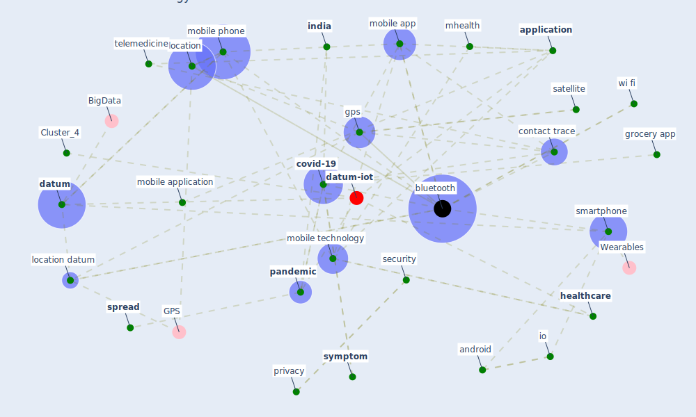

# Article: Mobile Technology Solution for COVID-19: Surveillance and Prevention (raza_mobile_2021)

* Source: [10.1007/978-981-15-8534-0_5](https://doi.org/10.1007/978-981-15-8534-0_5)
* Year: 2021
* Cluster: [iot-blockchain](cluster_7)

## Keywords

 * 2 4 ghz, 5 ghz, [alert](keyword_alert), android, [application](keyword_application), [bluetooth](keyword_bluetooth), cell phone, [china](keyword_china), colour code, computer scientist, contact trace, [covid 19 pandemic](keyword_covid_19_pandemic), [covid-19](keyword_covid-19), [datum](keyword_datum), datum security, deserno, developer, [diagnosis](keyword_diagnosis), [disease](keyword_disease), doctor, edirisinghe, [education](keyword_education), encrypt, [epidemic](keyword_epidemic), false alert, frequency, [government](keyword_government), [gps](keyword_gps), grocery app, [health](keyword_health), health organization, health service, health status, [health system](keyword_health_system), [healthcare](keyword_healthcare), heesterbeek, [hospital](keyword_hospital), hotspot, [india](keyword_india), io, io contact trace, kapoor, location, location datum, [lockdown](keyword_lockdown), makin, [medical](keyword_medical), medicine, mhealth, milani, [misinformation](keyword_misinformation), mobile app, mobile application, mobile health, mobile phone, mobile technology, normal, notify, ongoing pandemic, [outbreak](keyword_outbreak), [pandemic](keyword_pandemic), phone, [prevention](keyword_prevention), [privacy](keyword_privacy), [quarantine](keyword_quarantine), radiology, receiver, red zone, [research](keyword_research), router, [sar cov2](keyword_sar_cov2), satellite, science, [security](keyword_security), segment, self isolation, self quarantine, singapore, sm covid 19, [smartphone](keyword_smartphone), source code, [space](keyword_space), space segment, [spread](keyword_spread), [surveillance](keyword_surveillance), [symptom](keyword_symptom), tad, [taiwan](keyword_taiwan), tamil nadu, [technology](keyword_technology), [telemedicine](keyword_telemedicine), thomas edison, [trace](keyword_trace), [transmission](keyword_transmission), [user](keyword_user), video app, [wi fi](keyword_wi_fi), [wireless](keyword_wireless), wireless networking, [world health organization](keyword_world_health_organization)

## Concepts

 

## Neighbours

### Closest articles

* The role of 5G for digital healthcare against COVID-19 pandemic: Opportunities and challenges - [LINK](article_siriwardhana_role_2021)
* Emerging Technologies to Combat the COVID-19 Pandemic - [LINK](article_vaishya_emerging_2020)
* Telehealth overpromises during the Covid-19 pandemic - [LINK](article_ostherr_telehealth_2020)
* Leveraging Digital Transformation Technologies to Tackle COVID-19: Proposing a Privacy-First Holistic Framework - [LINK](article_arpaci_leveraging_2021)
* Digital technology and COVID-19 - [LINK](article_ting_digital_2020)
* A Comprehensive Review of the COVID-19 Pandemic and the Role of IoT, Drones, AI, Blockchain, and 5G in Managing its Impact - [LINK](article_chamola_comprehensive_2020)
* COVID-19: A new digital dawn? - [LINK](article_robbins_covid-19_2020)
* Response to COVID-19 in Taiwan - [LINK](article_wang_response_2020)
* Supporting Technologies for COVID-19 Prevention: Systemized Review - [LINK](article_zhao_supporting_2022)
* Exploring the Potential of Artificial Intelligence and Machine Learning to Combat COVID-19 and Existing Opportunities for LMIC: A Scoping Review - [LINK](article_naseem_exploring_2020)

### Closest BPs

* Blueprint: Resilience in staffing and skills training - [LINK](bp_12)
* Blueprint: Negative pressure rooms - [LINK](bp_13)
* Blueprint: Installing UV in ductwork - [LINK](bp_10)
