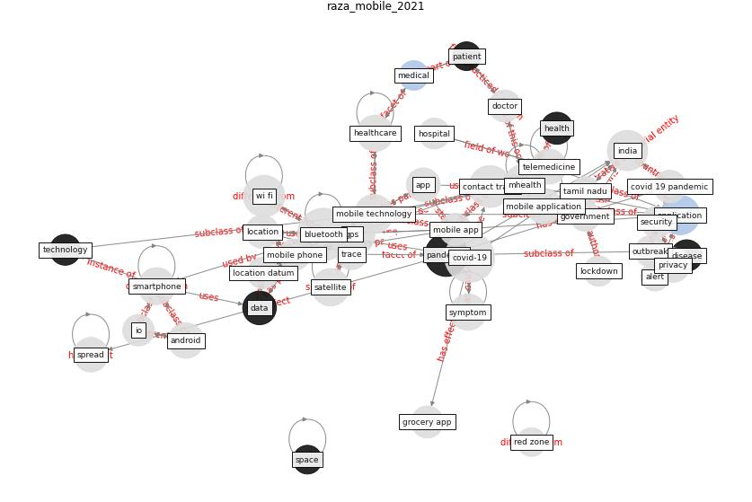

# Article: __Mobile Technology Solution for COVID-19: Surveillance and Prevention__ (raza_mobile_2021)

* [10.1007/978-981-15-8534-0_5](https://doi.org/10.1007/978-981-15-8534-0_5)
* Cluster: [blockchain-ai](cluster_11)

## Keywords

* [bluetooth](keyword_bluetooth), [covid-19](keyword_covid-19), [gps](keyword_gps), [pandemic](keyword_pandemic), [contact trace](keyword_contact_trace), [mhealth](keyword_mhealth), [india](keyword_india), [application](keyword_application), [wi fi](keyword_wi_fi), [mobile technology](keyword_mobile_technology), satellite, [healthcare](keyword_healthcare), [smartphone](keyword_smartphone), android, [privacy](keyword_privacy)

## Keywords at large

* [bluetooth](keyword_bluetooth), [covid-19](keyword_covid-19), [gps](keyword_gps), [pandemic](keyword_pandemic), [mhealth](keyword_mhealth), [contact trace](keyword_contact_trace), [wi fi](keyword_wi_fi), [india](keyword_india), [application](keyword_application), [mobile technology](keyword_mobile_technology)

## Concepts

 

### Closest articles 

* [The role of 5G for digital healthcare against COVID-19 pandemic: Opportunities and challenges](article_siriwardhana_role_2021)
* [Leveraging Digital Transformation Technologies to Tackle COVID-19: Proposing a Privacy-First Holistic Framework](article_arpaci_leveraging_2021)
* [Internet of things (IoT) applications to fight against COVID-19 pandemic](article_singh_internet_2020)
* [Telehealth overpromises during the Covid-19 pandemic](article_ostherr_telehealth_2020)
* [Emerging Technologies to Combat the COVID-19 Pandemic](article_vaishya_emerging_2020)
* [Health Information Exchange with Blockchain amid Covid-19-like Pandemics](article_christodoulou_health_2020)
* [Significant applications of virtual reality for COVID-19 pandemic](article_singh_significant_2020)
* [COVID-19: A new digital dawn?](article_robbins_covid-19_2020)
* [A Comprehensive Review of the COVID-19 Pandemic and the Role of IoT, Drones, AI, Blockchain, and 5G in Managing its Impact](article_chamola_comprehensive_2020)
* [How Can Blockchain Help People in the Event of Pandemics Such as the COVID-19?](article_chang_how_2020)

### References 

* [The impact of COVID-19 and strategies for mitigation and
suppression in low- and middle-income countries](article_walker_impact_2020)

### Cited by 

