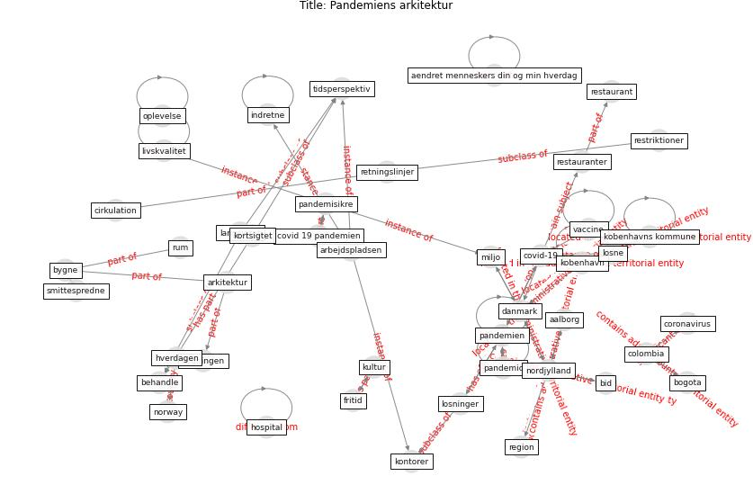

# Article: __Pandemiens arkitektur__ (realdania_pandemiens_2022)

* Year: 2022

## Keywords

* [covid-19](keyword_covid-19), [pandemien](keyword_pandemien), [kobenhavn](keyword_kobenhavn), [nordjylland](keyword_nordjylland), [livskvalitet](keyword_livskvalitet), [danmark](keyword_danmark), [arbejdspladsen](keyword_arbejdspladsen), [colombia](keyword_colombia), [losninger](keyword_losninger), [restauranter](keyword_restauranter), aalborg, region, pandemisikre, miljo, smittespredne

## Keywords at large

* [covid-19](keyword_covid-19), [pandemien](keyword_pandemien), [kobenhavn](keyword_kobenhavn), [nordjylland](keyword_nordjylland), [livskvalitet](keyword_livskvalitet), [danmark](keyword_danmark), [arbejdspladsen](keyword_arbejdspladsen), [colombia](keyword_colombia), [losninger](keyword_losninger), [restauranter](keyword_restauranter)

## Concepts

 

### Closest articles 

* [Refleksioner fra en pandemi](article_realdania_refleksioner_2022)
* [Urban Green Infrastructure and Green Open Spaces: An Issue of Social Fairness in Times of COVID-19 Crisis](article_reinwald_urban_2021)
* [10 Adaptive Measures for Public Places to face the COVID 19 Pandemic Outbreak](article_cheshmehzangi_10_2020)
* [The City Under COVID‐19: Podcasting As Digital Methodology](article_rogers_city_2020)
* [Association of built environment attributes with the spread of COVID-19 at its initial stage in China](article_li_association_2021)
* [Attitudes towards outdoor and neighbour noise during the COVID-19 lockdown: A case study in London](article_lee_attitudes_2021)
* [Effects of the COVID-19 pandemic on the use and perceptions of urban green space: An international exploratory study](article_ugolini_effects_2020)
* [Green in times of COVID-19: urban green space relevance during the COVID-19 pandemic in Buenos Aires City](article_marconi_green_2022)
* [Amplifying the role of knowledge translation platforms in the COVID-19 pandemic response](article_el-jardali_amplifying_2020)
* [Treating two pandemics for the price of one: Chronic and infectious disease impacts of the built and natural environment](article_frank_treating_2021)

