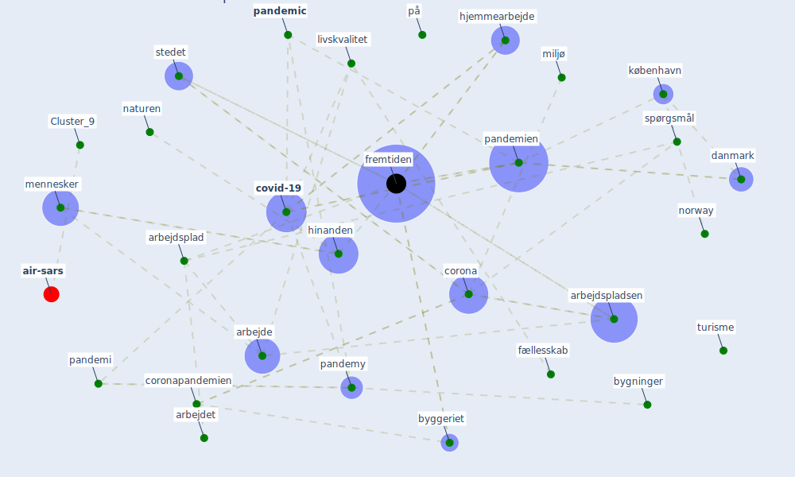

# Article: Refleksioner fra en pandemi (realdania_refleksioner_2022)

* Year: 2022
* Cluster: [air-sars](cluster_9)

## Keywords

 * aarhus, arbejde, arbejder, arbejdet, arbejdsmiljø, arbejdsplad, [arbejdspladsen](keyword_arbejdspladsen), [architecture](keyword_architecture), befolkningen, betydne, bl a, bolig, boligbyggeri, boligen, boliger, boligmarkedet, boligområder, boligpriserne, byerne, byggeriet, bygninger, byudvikle, [corona](keyword_corona), coronakrisen, coronapandemien, coronatiden, [coronavirus](keyword_coronavirus), [covid-19](keyword_covid-19), [danmark](keyword_danmark), dansk, danskere, danskerne, [datum](keyword_datum), [denmark](keyword_denmark), eek, f eks, f f, folk, folkesundheden, forlag, fremover, fremtiden, friluftsliv, fritid, fritidsboligen, funktioner, fysiske, fællesskab, fællesskabet, gang, [germany](keyword_germany), hinanden, hjemmearbejde, imidlertid, kollektive trafik, kommune, kommunerne, krav, kultur, kulturen, kulturliv, [københavn](keyword_københavn), landet, [livskvalitet](keyword_livskvalitet), livskvaliteten, mange, medarbejdere, medarbejderne, mennesker, miljø, mulighe, måde, natur, [naturen](keyword_naturen), nedlukningen, nedlukninger, norway, pandemi, [pandemic](keyword_pandemic), [pandemien](keyword_pandemien), pandemy, periode, på, realdania, rum, samfundet, sociale, spørgsmål, stedet, [stress](keyword_stress), teknologi, turisme, urbanisere, [ventilation](keyword_ventilation), videomøder, virkeligheden, [virus](keyword_virus), ældre, ændre, økonomiske

## Concepts

 

## Neighbours

### Closest articles

* Pandemiens arkitektur - [LINK](article_realdania_pandemiens_2022)
* Strengthening resilience: a priority shared by Health 2020 and - [LINK](article_who_strengthening_2017)
* Designing a Multi-Agent Occupant Simulation System to Support Facility Planning and Analysis for COVID-19 - [LINK](article_lee_designing_2021)
* Seeing the invisible hand: Underlying effects of COVID-19 on tourists’ behavioral patterns - [LINK](article_li_seeing_2020)
* Should I Stay or Should I Go? Tourists’ COVID-19 Risk Perception and Vacation Behavior Shift - [LINK](article_bratic_should_2021)
* Challenges of data sharing in European Covid-19 projects: A learning opportunity for advancing pandemic preparedness and response - [LINK](article_tacconelli_challenges_2022)
* 2020 Data Protection Report - [LINK](article_council_of_europe_2020_2020)
* Touchless Retail: What the Rest of the World could learn from China’s new ways to shop - [LINK](article_capgemini_touchless_2020)
* Retail Signage During the COVID-19 Pandemic - [LINK](article_mcneish_retail_2020)

### Closest BPs

* Blueprint: Smart Locker System - [LINK](bp_1)
* Blueprint: Monitoring of wastewater - [LINK](bp_21)
* Blueprint: Mental health – Belong: Do something with someone - [LINK](bp_19)
