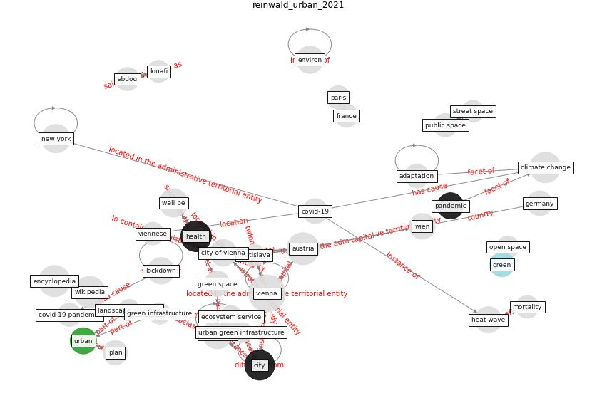

# Article: Urban Green Infrastructure and Green Open Spaces: An Issue of Social Fairness in Times of COVID-19 Crisis (reinwald_urban_2021)

* Source: [10.3390/su131910606](https://doi.org/10.3390/su131910606)
* Year: 2021
* Cluster: [urban-city](cluster_13)

## Keywords

 * abdou, [academy](keyword_academy), adaptation, assasi, [australia](keyword_australia), [austria](keyword_austria), basel, bern, bhattacharya, biome, bratislava, brazel, [build](keyword_build), [canada](keyword_canada), cervinka, [china](keyword_china), [city](keyword_city), city of vienna, clim, [climate change](keyword_climate_change), [covid 19 crisis](keyword_covid_19_crisis), [covid 19 pandemic](keyword_covid_19_pandemic), [covid-19](keyword_covid-19), crossesref, czech republic, demographic science, district, dowd, ecological, [ecosystem](keyword_ecosystem), ecosystem assessment, ecosystem service, engardt, [environmental](keyword_environmental), façade, [france](keyword_france), front, [germany](keyword_germany), [green](keyword_green), green infrastructure, [green space](keyword_green_space), [health](keyword_health), heat wave, hsu, [human health](keyword_human_health), [impact](keyword_impact), impact assess, [infrastructure](keyword_infrastructure), inhabitant, interdisziplinär, interior house, jiangxi, johansson, josefstadt, landscape planning, landscaping, language, lebensraum, [lockdown](keyword_lockdown), louafi, [manhattan](keyword_manhattan), mariahilf, morawetz, [mortality](keyword_mortality), [new york](keyword_new_york), [new york city](keyword_new_york_city), [ontario](keyword_ontario), open space, [pandemic](keyword_pandemic), paris, park, [plan](keyword_plan), praha, [public space](keyword_public_space), quarantine, rall, reinwald, reiter, [resilience](keyword_resilience), schönbauer, spat, statistik, street space, summer, [switzerland](keyword_switzerland), [sydney](keyword_sydney), uhi effect, [united kingdom](keyword_united_kingdom), [urban](keyword_urban), urban development, urban expansion, urban green, urban green infrastructure, urban heat island effect, [urban planning](keyword_urban_planning), van der jagt, [vienna](keyword_vienna), viennese, [well be](keyword_well_be), wien

## Concepts

 

## Neighbours

### Closest articles

* Green infrastructure through the lens of “One Health”: A systematic review and integrative framework uncovering synergies and trade-offs between mental health and wildlife support in cities - [LINK](article_felappi_green_2020)
* The impact of the COVID-19 pandemic on the importance of urban green spaces to the public - [LINK](article_noszczyk_impact_2022)
* Urban form: Realising the value of green space: a planners’ perspective on the COVID-19 pandemic - [LINK](article_ahmadpoor_urban_2021)
* The role of green roofs in post COVID-19 confinement: An analysis of willingness to pay - [LINK](article_manso_role_2021)
* Association between indoor-outdoor green features and psychological health during the COVID-19 lockdown in Italy: A cross-sectional nationwide study - [LINK](article_spano_association_2021)
* Effects of the COVID-19 pandemic on the use and perceptions of urban green space: An international exploratory study - [LINK](article_ugolini_effects_2020)
* Green in times of COVID-19: urban green space relevance during the COVID-19 pandemic in Buenos Aires City - [LINK](article_marconi_green_2022)
* Green spaces, especially forest, linked to lower SARS-CoV-2 infection rates: A one-year nationwide study - [LINK](article_jiang_green_2021)
* The Impact of COVID-19 on Public Space: A Review of the Emerging Questions - [LINK](article_honey-roses_impact_2020)
* Impact of Covid-19 on the built environment - [LINK](article_mahima_impact_2022)

### Closest BPs

* Blueprint: Mental health – Act: Do something - [LINK](bp_18)
* Blueprint: Mental health – Commit: Do something meaningfull - [LINK](bp_20)
* Blueprint: Mental health – Belong: Do something with someone - [LINK](bp_19)
