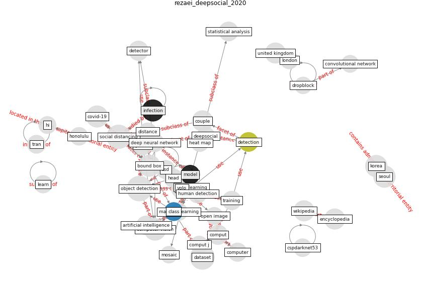

# Article: __DeepSOCIAL: Social Distancing Monitoring and Infection Risk Assessment in COVID-19 Pandemic__ (rezaei_deepsocial_2020)

* [10.3390/app10217514](https://doi.org/10.3390/app10217514)
* Cluster: [om-ai](cluster_1.md)

## Keywords

[infection](keyword_infection.md)

## Abstract

Social distancing is a recommended solution by the World
Health Organisation (WHO) to minimise the spread of
COVID-19 in public places. The majority of governments and
national health authorities have set the 2-m physical
distancing as a mandatory safety measure in shopping
centres, schools and other covered areas. In this research,
we develop a hybrid Computer Vision and YOLOv4-based Deep
Neural Network (DNN) model for automated people detection
in the crowd in indoor and outdoor environments using
common CCTV security cameras. The proposed DNN model in
combination with an adapted inverse perspective mapping
(IPM) technique and SORT tracking algorithm leads to a
robust people detection and social distancing monitoring.
The model has been trained against two most comprehensive
datasets by the time of the research—the Microsoft Common
Objects in Context (MS COCO) and Google Open Image
datasets. The system has been evaluated against the Oxford
Town Centre dataset (including 150,000 instances of people
detection) with superior performance compared to three
state-of-the-art methods. The evaluation has been conducted
in challenging conditions, including occlusion, partial
visibility, and under lighting variations with the mean
average precision of 99.8\% and the real-time speed of 24.1
fps. We also provide an online infection risk assessment
scheme by statistical analysis of the spatio-temporal data
from people’s moving trajectories and the rate of social
distancing violations. We identify high-risk zones with the
highest possibility of virus spread and infection. This may
help authorities to redesign the layout of a public place
or to take precaution actions to mitigate high-risk zones.
The developed model is a generic and accurate people
detection and tracking solution that can be applied in many
other fields such as autonomous vehicles, human action
recognition, anomaly detection, sports, crowd analysis, or
any other research areas where the human detection is in
the centre of attention.

## Concepts

 

