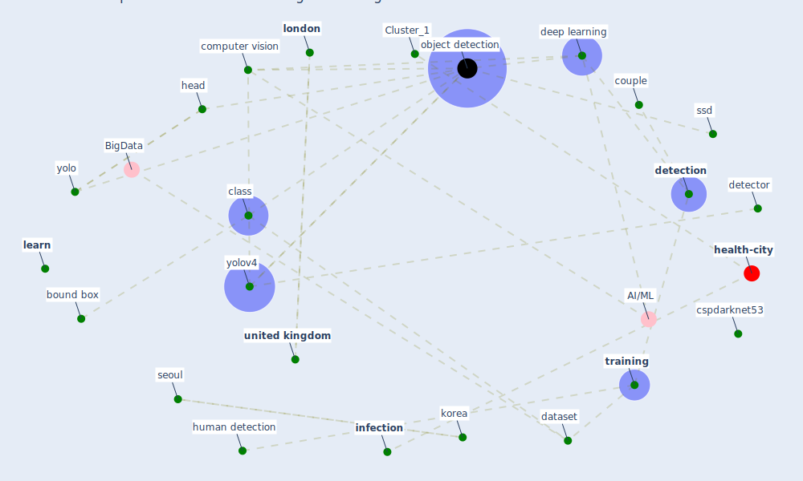

# Article: DeepSOCIAL: Social Distancing Monitoring and Infection Risk Assessment in COVID-19 Pandemic (rezaei_deepsocial_2020)

* Source: [10.3390/app10217514](https://doi.org/10.3390/app10217514)
* Year: 2020
* Cluster: [detection-object](cluster_8)

## Keywords

 * anchor box, backbone, backbone architecture, behaviour, bifpn, biol, bottom layer, [bound box](keyword_bound_box), cctv, [china](keyword_china), class, classify, coco, [computer](keyword_computer), [computer vision](keyword_computer_vision), couple, [covid 19 pandemic](keyword_covid_19_pandemic), [covid-19](keyword_covid-19), cspdarknet53, [dataset](keyword_dataset), [deep learning](keyword_deep_learning), deepsocial, [detection](keyword_detection), [detector](keyword_detector), [distance](keyword_distance), distance estimation, dnn, dropblock, duan, family, farhadi, fcos, fpn, frame, [germany](keyword_germany), girshick, gpu, grid cell, ground truth bounding box, head, heat map, heatmap, hi, honolulu, houston, [human](keyword_human), human detection, i d assignment, [image](keyword_image), [infection](keyword_infection), keypoint triplet, [korea](keyword_korea), las vegas, learn, learning rate, ljubljana, [london](keyword_london), loss function, mach, machine, machine learning, microsoft, mish, [model](keyword_model), mosaic, munich, nguyen, nv, [object detection](keyword_object_detection), occlusion, open image, oxford town centre, pattern recognit, pattern recognition, people detection, r cnn, redmon, [research](keyword_research), [russia](keyword_russia), [seoul](keyword_seoul), sfam, [slovenia](keyword_slovenia), [spread](keyword_spread), ssd, st petersburg, surveillance camera, swish, [switzerland](keyword_switzerland), three dimensional, top layer, track, [training](keyword_training), [united kingdom](keyword_united_kingdom), van huynh, [virus](keyword_virus), voc12, world coordinate, yao, [yolo](keyword_yolo), yolov4

## Concepts

 

## Neighbours

### Closest articles

* Towards the sustainable development of smart cities through mass video surveillance: A response to the COVID-19 pandemic - [LINK](article_shorfuzzaman_towards_2021)
* An Automated System to Limit COVID-19 Using Facial Mask Detection in Smart City Network - [LINK](article_rahman_automated_2020)
*  - [LINK](article_huy-tran_design_2022)
* Risk Diagnosis and Mitigation System of COVID-19 Using Expert System and Web Scraping - [LINK](article_mufid_risk_2020)
* COVID19-Routes: A Safe Pedestrian Navigation Service - [LINK](article_cantarero_covid19-routes_2021)
* Digital Twin of COVID-19 Mass Vaccination Centers - [LINK](article_pilati_digital_2021)
* Social distancing enhanced automated optimal design of physical spaces in the wake of the COVID-19 pandemic - [LINK](article_ugail_social_2021)
* Exploring the Non-Medical impacts of Covid-19 using Natural Language Processing - [LINK](article_agade_exploring_2020)
* Case Study on Finnish TVETA Resilient Model of Training During COVID-19 - [LINK](article_unesco_case_2021)
* Building occupancy estimation with people flow modeling in AnyLogic - [LINK](article_li_building_2016)

### Closest BPs

* Blueprint: Resilience in staffing and skills training - [LINK](bp_12)
* Blueprint: Tracking and enforcing use of Personal Protective Equipment - [LINK](bp_23)
* Blueprint: Public places as information points - [LINK](bp_8)
