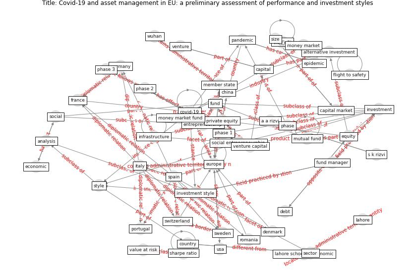

# Article: Covid-19 and asset management in EU: a preliminary assessment of performance and investment styles (rizvi_covid-19_2020)

* Source: [10.1057/s41260-020-00172-3](https://doi.org/10.1057/s41260-020-00172-3)
* Year: 2020
* Cluster: [construction-resilience](cluster_5)

## Keywords

 * a a rizvi, actively manage fund, alternative investment, analysis, asset class, [austria](keyword_austria), b naqvi, belgium, capital, capital market, [china](keyword_china), chinese authority, [construction](keyword_construction), [coronavirus](keyword_coronavirus), [country](keyword_country), [covid-19](keyword_covid-19), credit rating, debt, [denmark](keyword_denmark), [economic](keyword_economic), economic modelling, [entrepreneurship](keyword_entrepreneurship), [epidemic](keyword_epidemic), equity, equity fund, [europe](keyword_europe), [european union](keyword_european_union), evolve, financial economic, financialmarket, flatten the curve, flight to safety, [france](keyword_france), fund, fund manager, [germany](keyword_germany), growth, hedge fund, high risk, household debt, i1 t, i2 t, [infection](keyword_infection), [infrastructure](keyword_infrastructure), intークe2i, investment, investment strategy, investment style, [italy](keyword_italy), lahore, lahore school of economic, lahore university of management science, low risk, [member state](keyword_member_state), mining, money market, money market fund, mutual fund, n mirza, pakistan, [pandemic](keyword_pandemic), pantheon sorbonne, passive index, [phase](keyword_phase), phase 1, [phase 2](keyword_phase_2), phase 3, [poland](keyword_poland), [portugal](keyword_portugal), private equity, real estate, return, [risk](keyword_risk), risk adjust performance, risk adjust return, risk management, risky, robust, romania, s k rizvi, [sector](keyword_sector), serbia, sharpe ratio, size, [social](keyword_social), social entrepreneurship, [spain](keyword_spain), [spread](keyword_spread), stage 3, style, [sweden](keyword_sweden), [switzerland](keyword_switzerland), the rest of this paper, university of paris 1, [usa](keyword_usa), value at risk, venture, venture capital, volatility, [wuhan](keyword_wuhan)

## Concepts

 

## Neighbours

### Closest articles

* Building sustainable finance for resilient protected and conserved areas: lessons from COVID-19 - [LINK](article_cumming_building_2021)
* Global value chains: Efficiency and risks in the context of COVID-19 - [LINK](article_oecd_global_2021)
* World Bank Development Report - [LINK](article_world_bank_world_2022)
* COVID-19 and regional solutions for mitigating the risk of SME finance in selected ASEAN member states - [LINK](article_taghizadeh-hesary_covid-19_2022)
* Mapping research in logistics and supply chain management during COVID-19 pandemic - [LINK](article_montoya-torres_mapping_2021)
* From Viral City to Smart City: Learning from Pandemic Experiences - [LINK](article_sakellarides_viral_2020)
* Startups in times of crisis – A rapid response to the COVID-19 pandemic - [LINK](article_kuckertz_startups_2020)
* <scp>COVID</scp>             ‐19: Small and medium enterprises challenges and responses with creativity, innovation, and entrepreneurship - [LINK](article_thukral_covid19_2021)
* Amplifying the role of knowledge translation platforms in the COVID-19 pandemic response - [LINK](article_el-jardali_amplifying_2020)

### Closest BPs

* Blueprint: Smart Locker System - [LINK](bp_1)
* Blueprint: Rotational Shift System - [LINK](bp_0)
* Blueprint: One-way mobility circulation - [LINK](bp_4)
