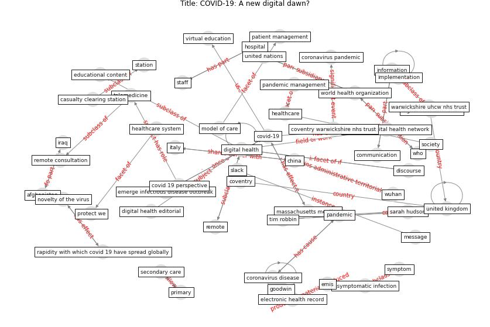

# Article: COVID-19: A new digital dawn? (robbins_covid-19_2020)

* Source: [10.1177/2055207620920083](https://doi.org/10.1177/2055207620920083)
* Year: 2020
* Cluster: [city-health](cluster_14)

## Keywords

 * afghanistan, asymptomatic infection, attribute, cardiology, casualty clearing station, centralised support, [china](keyword_china), communication, conference, coronavirus disease, coronavirus disease covid 19 pandemic, coronavirus infection, coronavirus pandemic, coventry, coventry warwickshire nhs trust, covid 19 coronavirus outbreak, covid 19 outbreak, covid 19 perspective, [covid-19](keyword_covid-19), dauk, develop organically, digital communication, digital educational initiative, [digital health](keyword_digital_health), digital health editorial, digital health network, digital health transformation, digital health volume 6, digitalhealth org, discourse, discourse digital health network, [disease](keyword_disease), doctor association, doctor s association uk, doctors association uk, [economy](keyword_economy), educational content, electronic health record, emerge infectious disease outbreak, emergent, emis, [facebook](keyword_facebook), [goodwin](keyword_goodwin), [healthcare](keyword_healthcare), healthcare system, [hospital](keyword_hospital), implementation, infect, [information](keyword_information), iraq, [italy](keyword_italy), massachusetts meeting, message, model of care, [network](keyword_network), novelty of the virus, [pandemic](keyword_pandemic), pandemic management, patient management, primary, protect we, rapidity, rapidity with which covid 19 have spread globally, remote, remote consultation, respiratory failure, sarah hudson, secondary, secondary care, slack, [social medium](keyword_social_medium), [society](keyword_society), society as a whole, [spread](keyword_spread), staff, station, subclinical, [switzerland](keyword_switzerland), [symptom](keyword_symptom), taiwan s sar response, telemedicine, the human cost of the disease, the pandemic, tim robbin, trainee, training course, [twitter](keyword_twitter), [united kingdom](keyword_united_kingdom), united kingdom uk, [united nations](keyword_united_nations), vid 19, video conference, virtual education, warfare, warwickshire uhcw nhs trust, west midland, west midland region, who, [world health organization](keyword_world_health_organization), [wuhan](keyword_wuhan)

## Concepts

 

## Neighbours

### Closest articles

* Using Technology to Maintain the Education of Residents During the COVID-19 Pandemic - [LINK](article_chick_using_2020)
* Telehealth overpromises during the Covid-19 pandemic - [LINK](article_ostherr_telehealth_2020)
* Significant applications of virtual reality for COVID-19 pandemic - [LINK](article_singh_significant_2020)
* Case Study on Finnish TVETA Resilient Model of Training During COVID-19 - [LINK](article_unesco_case_2021)
* Management of the COVID-19 pandemic: challenges, practices, and organizational support - [LINK](article_hossny_management_2022)
* 10 tech trends getting us through the COVID-19 pandemic - [LINK](article_yan_10_2020)
* Supporting Technologies for COVID-19 Prevention: Systemized Review - [LINK](article_zhao_supporting_2022)
* Emergency Healthcare Facilities: Managing Design in a Post Covid-19 World - [LINK](article_marinelli_emergency_2020)
* Rotating groups at work, school best against COVID-19 spread: Study - [LINK](article_afp_rotating_2021)
* Internet of things (IoT) applications to fight against COVID-19 pandemic - [LINK](article_singh_internet_2020)

### Closest BPs

* Blueprint: Resilience in staffing and skills training - [LINK](bp_12)
* Blueprint: Installing high-efficiency air filters - [LINK](bp_11)
* Blueprint: Negative pressure rooms - [LINK](bp_13)
