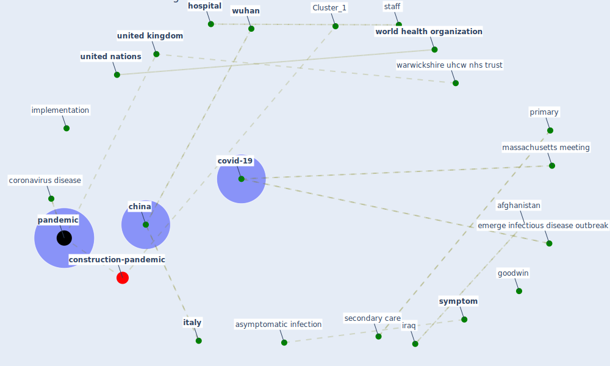

# Article: COVID-19: A new digital dawn? (robbins_covid-19_2020)

* Source: [10.1177/2055207620920083](https://doi.org/10.1177/2055207620920083)
* Year: 2020
* Cluster: [health-city](cluster_1)

## Keywords

 * afghanistan, asymptomatic infection, attribute, cardiology, casualty, casualty clearing station, centralised support, cern, [china](keyword_china), communication, [conference](keyword_conference), conflict, coordination, [coronavirus](keyword_coronavirus), coronavirus disease, coronavirus disease covid 19 pandemic, coronavirus infection, coronavirus pandemic, coventry, coventry warwickshire nhs trust, covid 19 coronavirus outbreak, covid 19 outbreak, covid 19 perspective, [covid-19](keyword_covid-19), dauk, develop, develop organically, digitalhealth org, discourse, [disease](keyword_disease), doctor association, doctor s association uk, doctors association uk, [economy](keyword_economy), electronic health record, emerge infectious disease outbreak, emergent, emis, examination, [goodwin](keyword_goodwin), [healthcare](keyword_healthcare), [healthcare system](keyword_healthcare_system), healthcare system internationally, healthcare workforce, [hospital](keyword_hospital), implement, implementation, [infect](keyword_infect), infect dis clin infect dis, [infection](keyword_infection), [information](keyword_information), [innovation](keyword_innovation), iraq, [italy](keyword_italy), long remember, massachusetts meeting, message, message tool, model of care, modernisation of healthcare, novelty of the virus, open access, [pandemic](keyword_pandemic), pandemic management, patient management, primary, protect we, rapidity with which covid 19 have spread globally, remote consultation, respiratory failure, sarah hudson, secondary, secondary care, slack, [society](keyword_society), society as a whole, [spread](keyword_spread), staff, station, subclinical, [switzerland](keyword_switzerland), [symptom](keyword_symptom), taiwan s sar response, [telemedicine](keyword_telemedicine), the human cost of the disease, the pandemic, tim robbin, trainee, training course, [united kingdom](keyword_united_kingdom), united kingdom uk, [united nations](keyword_united_nations), video conference, warfare, warwickshire uhcw nhs trust, west midland, west midland region, who, [world health organization](keyword_world_health_organization), [wuhan](keyword_wuhan)

## Concepts

 

## Neighbours

### Closest articles

* Telehealth overpromises during the Covid-19 pandemic - [LINK](article_ostherr_telehealth_2020)
* Response to COVID-19 in Taiwan - [LINK](article_wang_response_2020)
* Supporting Technologies for COVID-19 Prevention: Systemized Review - [LINK](article_zhao_supporting_2022)
* Emergency Healthcare Facilities: Managing Design in a Post Covid-19 World - [LINK](article_marinelli_emergency_2020)
* Covid-19 and community mitigation strategies in a pandemic - [LINK](article_ebrahim_covid-19_2020)
* Overview of the mitigation strategies for COVID-19 pandemic - [LINK](article_ads_overview_2020)
* Management of the COVID-19 pandemic: challenges, practices, and organizational support - [LINK](article_hossny_management_2022)
* Mobile Technology Solution for COVID-19: Surveillance and Prevention - [LINK](article_raza_mobile_2021)
* Coronavirus disease 2019: The harms of exaggerated information and non‐evidence‐based measures - [LINK](article_ioannidis_coronavirus_2020)
* Wastewater surveillance for population-wide Covid-19: The present and future - [LINK](article_daughton_wastewater_2020)

### Closest BPs

* Blueprint: Resilience in staffing and skills training - [LINK](bp_12)
* Blueprint: Negative pressure rooms - [LINK](bp_13)
* Blueprint: Installing UV in ductwork - [LINK](bp_10)
